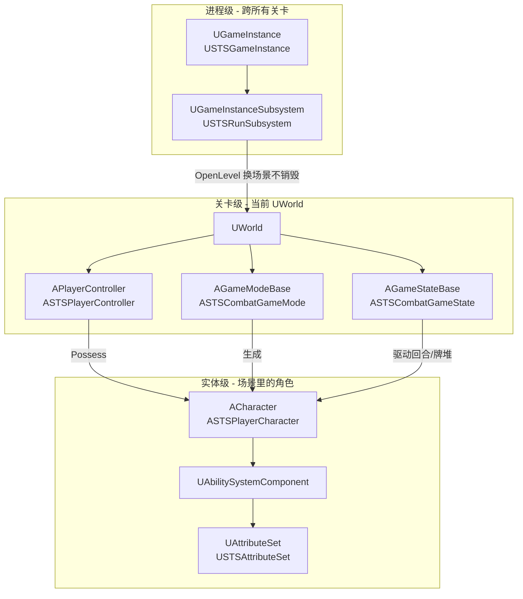
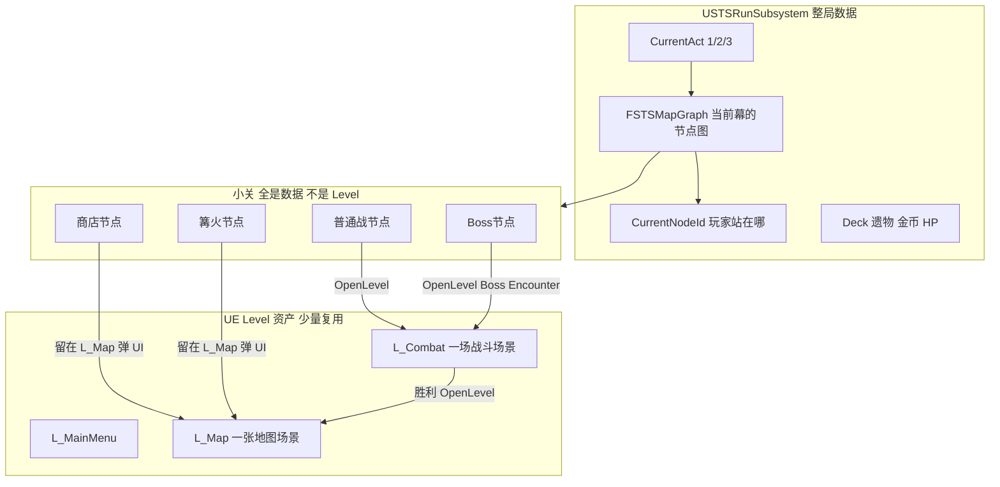
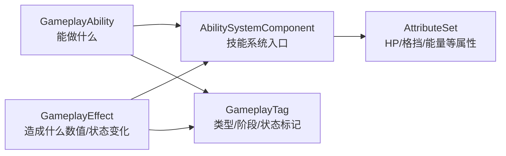
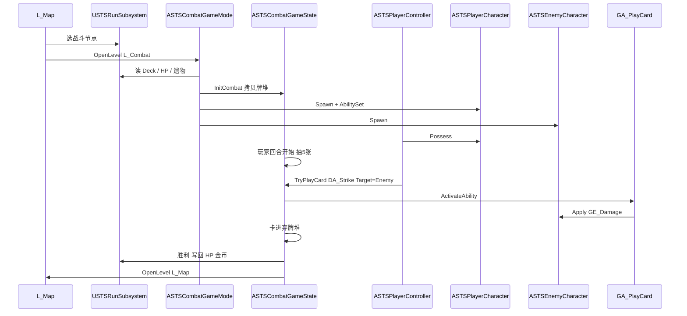

# Unreal 核心概念学习手册（以 unrealSTS 为例）

> 面向 GAS 学习项目：每个概念说明 **引擎里是什么、该用哪个类、在本项目里对应尖塔的什么**。
>
> 配套计划文档：[01_sts_gas_architecture.md](../plan/01_sts_gas_architecture.md) · [02_ui_framework.md](../plan/02_ui_framework.md)

---

## 一、先建立一张「生命周期地图」

Unreal 不是一个大 `Manager` 管到底，而是 **不同生命周期的对象各管一段**。



**记忆口诀：**

| 存活多久 | 用什么 |
|----------|--------|
| 整次游戏启动到退出 | `UGameInstance` |
| 一次 Run（跨主菜单→地图→多场战斗） | `UGameInstanceSubsystem` |
| 当前加载的这一个关卡 | `UWorld` + `ULevel` |
| 本关规则（谁生成、怎么开局） | `AGameModeBase` |
| 本关对局状态（回合、比分、牌堆） | `AGameStateBase` |
| 玩家输入与 UI | `APlayerController` |
| 场景里能动的角色 | `APawn` / `ACharacter` |
| 角色身上的技能与数值 | GAS：`ASC` + `AttributeSet` |

---

## 二、引擎基础概念

### 2.1 UWorld（常说的「游戏世界」）

| 项目 | 说明 |
|------|------|
| **是什么** | 当前加载关卡的运行时世界容器：所有 Actor、物理、Tick、子系统都挂在它下面。 |
| **常用类** | `UWorld`（引擎内置，一般不继承） |
| **怎么拿到** | `GetWorld()`、`UGameplayStatics::GetGameInstance(World)`、`GWorld`（仅特定上下文） |
| **生命周期** | `OpenLevel` 加载新地图时，旧 World 销毁，新 World 创建。 |

**尖塔例子：**

- 你在 **`L_Map`** 里点了一个战斗节点 → `OpenLevel("L_Combat")` → **旧的地图 World 没了**，新的战斗 World 开始。
- Run 里的牌组不能放 World 里（会随换关丢失）→ 放 **`USTSRunSubsystem`**（挂在 GameInstance 上）。

**本项目不用：** 自定义 `GameWorld` 单例类——引擎已有 `UWorld`。

---

### 2.2 ULevel 与地图资产

| 项目 | 说明 |
|------|------|
| **是什么** | 一个关卡/场景：地形、灯光、放置的 Actor、World Settings。 |
| **常用类 / 资产** | `ULevel`；内容浏览器里 `L_*.umap` |
| **生命周期** | 随 `UWorld` 加载/卸载。 |

**尖塔例子：**

| 地图资产 | 尖塔场景 |
|----------|----------|
| `L_MainMenu` | 主菜单 |
| `L_Map` | 爬塔地图（选节点、商店、篝火） |
| `L_Combat` | 单场战斗 |

每个 `.umap` 在 **World Settings** 里指定自己的 **GameMode**（见 2.4）。

---

### 2.3 UGameInstance

| 项目 | 说明 |
|------|------|
| **是什么** | 游戏进程级对象：从启动到退出只有一个（单机）。跨关卡数据应挂在这里。 |
| **常用类** | `UGameInstance` → 项目 **`USTSGameInstance`** |
| **配置位置** | `Project Settings → Maps & Modes → Game Instance Class` |
| **典型职责** | 初始化子系统、保存全局设置、关卡切换时不被销毁的数据入口。 |

**尖塔例子：**

- 玩家点「开始新 Run」→ `USTSGameInstance` 存在 → 调用 `USTSRunSubsystem::NewRun()`。
- 从战斗关回到地图关，**GameInstance 一直在**，所以金币、遗物、牌组还在。

```cpp
// 典型访问方式
UGameInstance* GI = GetGameInstance();
USTSRunSubsystem* Run = GI->GetSubsystem<USTSRunSubsystem>();
```

---

### 2.4 Subsystem（子系统）

| 项目 | 说明 |
|------|------|
| **是什么** | 引擎提供的「按生命周期自动创建/销毁」的模块化单例，比手写 Manager 更地道。 |
| **常用类** | `UGameInstanceSubsystem`、`UWorldSubsystem`、`ULocalPlayerSubsystem`、`UEngineSubsystem` |
| **获取** | `GetGameInstance()->GetSubsystem<T>()` 或 `GetWorld()->GetSubsystem<T>()` |

| 子系统类型 | 存活范围 | 尖塔 / 本项目 |
|------------|----------|----------------|
| **GameInstanceSubsystem** | 整个 GameInstance | **`USTSRunSubsystem`**：Deck、遗物、金币、地图进度 |
| **WorldSubsystem** | 当前 UWorld | v0.1 暂不用；若要做「仅战斗关全局特效」可考虑 |
| **LocalPlayerSubsystem** | 本地玩家 | **`USTSUIManagerSubsystem`**（UI 计划）：管理 CommonUI 层 |

**尖塔例子：**

- **整局牌组** → `USTSRunSubsystem::Deck`（`TArray<FSTSCardInstance>`）
- **本场手牌** → 不放 Subsystem，放 **`ASTSCombatGameState`**（战斗 World 销毁时一起清掉）

---

### 2.5 AGameModeBase（GameMode）

| 项目 | 说明 |
|------|------|
| **是什么** | **仅存在于 Server / 单机 Authority** 的「关卡规则」：生成谁、默认 Pawn、开局流程。客户端没有 GameMode。 |
| **常用类** | `AGameModeBase` → **`ASTSCombatGameMode`** / `ASTSMapGameMode` / `ASTSMainMenuGameMode` |
| **配置** | 每个 `L_*.umap` 的 World Settings，或 `DefaultEngine.ini` 的 `GlobalDefaultGameMode` |
| **不应放** | 大量 UI 逻辑、每帧 Tick 的战斗数值（那些给 GameState / ASC） |

**尖塔例子：**

`ASTSCombatGameMode::StartPlay()` 里：

1. 从 `USTSRunSubsystem` 读取玩家 HP、Deck
2. 生成 `ASTSPlayerCharacter`、敌人 `ASTSEnemyCharacter`
3. 给双方 `USTSAbilitySet::GiveToAbilitySystem()`
4. 通知 `ASTSCombatGameState::InitCombat(DeckCopy)`

---

### 2.6 AGameStateBase（GameState）

| 项目 | 说明 |
|------|------|
| **是什么** | 与 GameMode 同关卡的「对局状态」：设计上 **所有人都能访问**（未来联网可同步）。 |
| **常用类** | `AGameStateBase` → **`ASTSCombatGameState`** |
| **典型职责** | 回合阶段、手牌/抽弃牌堆、胜负、广播回合事件。 |

**尖塔例子：**

| 数据 / 行为 | 放在 GameState 的原因 |
|-------------|------------------------|
| 当前是玩家回合还是敌人回合 | 整场战斗的「裁判」状态 |
| Hand / DrawPile / DiscardPile | 只属于这一场战斗，打完就丢 |
| `TryPlayCard()`、`EndPlayerTurn()` | 战斗流程入口 |
| `OnCombatVictory()` → 写回 RunSubsystem | 关末结算桥梁 |

**对比 GameMode：** GameMode 决定「怎么开始」；GameState 持有「进行中的一切可查询状态」。

---

### 2.7 APlayerController

| 项目 | 说明 |
|------|------|
| **是什么** | 玩家代理：输入、相机、HUD、UI 的拥有者。不是角色本体。 |
| **常用类** | `APlayerController` → **`ASTSPlayerController`** |
| **与 Pawn 关系** | `Possess(Pawn)` 后，输入驱动 Pawn；换关会重新 Possess 新 Pawn。 |

**尖塔例子：**

- 战斗 HUD（`WBP_CombatHUD`）由 PlayerController 创建或挂在 CommonUI Layout 上。
- 玩家拖动卡牌到敌人 → UI 通知 **`USTSCombatUIController`** → 调 **`ASTSCombatGameState::TryPlayCard()`**。
- PlayerController **不存 HP、不存手牌**——只负责「传话」。

---

### 2.8 APawn / ACharacter

| 项目 | 说明 |
|------|------|
| **是什么** | 世界里可控制的实体。`ACharacter` = Pawn + 角色移动组件（Capsule、Movement）。 |
| **常用类** | **`ASTSPlayerCharacter`**、**`ASTSEnemyCharacter`** |
| **组件** | `UAbilitySystemComponent`（必须）、网格/动画（战斗可极简） |

**尖塔例子：**

| 实体 | Pawn 上挂什么 |
|------|----------------|
| 铁甲战士 | ASC + `USTSAttributeSet`（HP、格挡、能量） |
| 邪教徒敌人 | ASC + `USTSAttributeSet` + `IntentComponent`（显示意图） |

地图关 **可以没有战斗 Pawn**（纯 UI 选节点）；战斗关才生成 Character。

---

### 2.9 APlayerState（本项目 v0.1 跳过）

| 项目 | 说明 |
|------|------|
| **是什么** | 联网时「玩家身份」的持久对象，Lyra 等用它做第二套 ASC。 |
| **本项目** | 单机学习从简，**不实现**；Run 数据用 `RunSubsystem`，战斗数据用 GameState + Pawn ASC。 |

---

### 2.10 三幕「大关」vs 地图「小关」vs UE Level（核心辨析）

尖塔一局 Run 里你会听到三层概念，**不要混为一谈**：

| 概念 | 尖塔里是什么 | 是否 = 一个 `.umap` 关卡 | 数据放哪 |
|------|--------------|--------------------------|----------|
| **大关（幕 Act）** | 第 1/2/3 幕，每幕一张分叉地图，末尾 Boss | **否** | `USTSRunSubsystem::CurrentAct` |
| **小关（地图节点 Node）** | 地图上某一个点：普通战 / 精英 / 商店 / 篝火 / Boss | **否** | `FSTSMapGraph` 里的 `FSTSMapNode` |
| **UE Level** | 真正加载的场景资产 | **是** | `L_MainMenu` / `L_Map` / `L_Combat` |

**结论（学习项目推荐）：**

- 全游戏只需 **少量 UE 关卡**（3～4 个），**不为每个小关做一个 Level**。
- 三幕大关 = **RunSubsystem 里的数据状态** + 地图 UI 换肤/换遭遇池，不是 `L_Map_Act1`、`L_Map_Act2`、`L_Map_Act3` 各做一张图（除非你想做美术差异，那是可选增强）。
- 每一个小关 = **地图图结构里的一个节点**；只有节点类型是「战斗类」时才 `OpenLevel("L_Combat")`。



#### 一局 Run 的完整流程（三幕）

```mermaid
stateDiagram-v2
    [*] --> Act1: NewRun
    Act1 --> Act1Map: 生成第1幕地图
    Act1Map --> Act1Node: 选小关节点
    Act1Node --> Act1Combat: 战斗类节点
    Act1Node --> Act1Event: 商店/篝火
    Act1Combat --> Act1Map: 胜利回地图
    Act1Event --> Act1Map: 完成交互
    Act1Map --> Act2: 击败第1幕Boss
    Act2 --> Act2Map: 生成第2幕地图
    Act2Map --> Act2Node: 选小关...
    Act2Map --> Act3: 击败第2幕Boss
    Act3 --> Act3Map: 生成第3幕地图
    Act3Map --> Victory: 击败第3幕Boss
    Act1Combat --> Defeat: 玩家死亡
    Defeat --> [*]
    Victory --> [*]
```



#### 小关（Node）类型与场景行为

| 节点类型 | 尖塔行为 | UE 怎么做 |
|----------|----------|-----------|
| `Combat` / `Elite` | 进战斗 | `OpenLevel(L_Combat?Encounter=DA_Encounter_xxx)` |
| `Boss` | 幕末 Boss 战 | 同上，Encounter 指向 Boss 数据；胜利后 `RunSubsystem::AdvanceAct()` |
| `Shop` | 商店买卡/遗物 | **不换 Level**；`WBP_Shop` Push 到 `L_Map` 的 UI 层 |
| `Rest` | 回血 / 升级卡 | **不换 Level**；`WBP_RestSite` |
| `Treasure` / `Event` | 开宝箱 / 事件 | **不换 Level**；弹窗 + 改 RunSubsystem 数据 |

#### 推荐数据结构（C++ 示意）

```cpp
// 单个小关 = 图中的一个节点（不是 ULevel）
UENUM()
enum class ESTSMapNodeType : uint8
{
    Combat, Elite, Shop, Rest, Treasure, Boss
};

USTRUCT()
struct FSTSMapNode
{
    FName NodeId;
    int32 LayerIndex;           // 第几「层」列（尖塔地图从左到右）
    ESTSMapNodeType Type;
    ESTSMapNodeState State;     // Locked / Available / Cleared
    TObjectPtr<USTSEncounterData> Encounter;  // 战斗类节点用
    TArray<FName> NextNodeIds;  // 指向下层可去的节点（分叉）
};

USTRUCT()
struct FSTSMapGraph
{
    int32 ActIndex;             // 1 / 2 / 3 —— 这就是「大关」
    TArray<FSTSMapNode> Nodes;
    FName EntryNodeId;
    FName BossNodeId;
};

// USTSRunSubsystem 内
int32 CurrentAct = 1;
FSTSMapGraph CurrentMapGraph;
FName CurrentNodeId;
TArray<FSTSCardInstance> Deck;
// ...
void GenerateMapForAct(int32 ActIndex);  // 程序化生成或读 DA_Map_Act1
void EnterNode(FName NodeId);            // 根据 Type 分支：OpenLevel 或弹 UI
void AdvanceAct();                       // Boss 胜利：Act++，重新 GenerateMap
```

#### 遭遇（Encounter）与幕的关系

| 资产 | 作用 |
|------|------|
| `USTSEncounterData` | 这一场战斗刷哪些敌人：`DA_Encounter_Cultistx2` |
| `USTSActConfigData`（可选） | 每幕配置：普通战池、精英池、Boss、地图层数、金币系数 |
| `DA_Map_Act1`（可选） | 固定地图模板；v0.1 可手写 8 节点，正式用 `MapGenerator` |

第 2 幕普通战和第 1 幕 **共用同一个 `L_Combat`**，只是 `OpenLevel` 时传入的 `Encounter` 和敌人等级不同。

#### v0.1 与学习版完整版

| 范围 | 幕 | 每幕节点 | UE Level 数 |
|------|-----|----------|-------------|
| **v0.1 可玩** | 先只做 **Act 1** | 8 节点 | 3：`L_MainMenu` / `L_Map` / `L_Combat` |
| **完整尖塔** | Act 1→2→3 | 每幕 ~15 层节点 | **仍然 3 个**；只增加数据和 UI 换幕 |

架构上 **一开始就把 `CurrentAct` + `FSTSMapGraph` 设计好**，v0.1 只填 Act 1 的内容，避免以后为加第 2/3 幕推倒重来。

---

## 三、数据与内容资产

### 3.1 UPrimaryDataAsset / UDataAsset

| 项目 | 说明 |
|------|------|
| **是什么** | 内容浏览器里的「配置数据」：卡牌定义、敌人定义、遗物定义，不是场景里的 Actor。 |
| **常用类** | `UPrimaryDataAsset` → **`USTSCardData`**、`USTSRelicData`、`USTSEnemyData` |
| **命名** | `DA_Card_Strike`、`DA_Relic_BurningBlood` |
| **特点** | 改数据不用编译 C++；策划/学习时在编辑器里新建资产即可。 |

**尖塔例子：**

一张「打击」卡 = 一个 `DA_Card_Strike`：

- 费用 `1`
- 类型 Tag `STS.Card.Type.Attack`
- 效果数组 `BaseEffects` / `UpgradedEffects`（伤害 6 → 9）

**运行时实例**（本局是否升级）不写在 DataAsset 里，写在 **`FSTSCardInstance`**（RunSubsystem 的 Deck 条目）。

---

### 3.2 静态定义 vs 运行时实例

| 概念 | 类型 | 存放位置 | 例子 |
|------|------|----------|------|
| 卡长什么样 | `USTSCardData` | `Content/STS/Cards/` | 打击、防御、愤怒 |
| 本局拥有的某张卡 | `FSTSCardInstance` | `USTSRunSubsystem::Deck` | 打击+（已升级）、打击（未升级） |
| 战斗中的手牌顺序 | 卡牌 ID 列表 | `ASTSCombatGameState::Hand` | 从 Deck 拷贝并洗牌 |

---

## 四、GAS（Gameplay Ability System）

GAS 是 Unreal 的 **技能与属性框架**，适合尖塔这种「数值 + 状态 + 效果」游戏。

### 4.1 总览：五个核心零件



| 零件 | 引擎基类 | 本项目类 | 干什么 |
|------|----------|----------|--------|
| **ASC** | `UAbilitySystemComponent` | `USTSAbilitySystemComponent` | 角色身上的 GAS 枢纽：授予 GA、应用 GE、持有 Tag |
| **AttributeSet** | `UAttributeSet` | `USTSAttributeSet` | 可复制属性：Health、Block、Energy、Poison… |
| **GameplayAbility** | `UGameplayAbility` | `GA_PlayCard`、`GA_EnemyAction`… | **少量通用**「能激活的能力」 |
| **GameplayEffect** | `UGameplayEffect` | `GE_Damage`、`GE_ApplyBlock`… | 改属性、挂 Buff、瞬时/持续 |
| **GameplayTag** | `FGameplayTag` | `STS.Card.Type.Attack`、`STS.Phase.PlayerTurn` | 查询与过滤，不存数值 |

---

### 4.2 UAbilitySystemComponent（ASC）

| 项目 | 说明 |
|------|------|
| **挂在哪** | `ACharacter` 上，通常 `IAbilitySystemInterface::GetAbilitySystemComponent()` 返回 |
| **管什么** | 已授予的 GA、正在生效的 GE（Buff）、拥有的 Tag |
| **不管什么** | **牌组、手牌、地图节点**——这些不是 GAS 设计目标 |

**尖塔例子：**

```text
玩家打出「打击」：
  CombatGameState.TryPlayCard()
    → GA_PlayCard::ActivateAbility()
      → STSEffectExecutor 读 CardData.Effects
      → ASC.ApplyGameplayEffectToTarget(GE_Damage, EnemyASC)
```

敌人身上的 **易伤、虚弱、力量** = 敌人 ASC 上的 **Active GameplayEffects**。

---

### 4.3 UAttributeSet（AS）

| 项目 | 说明 |
|------|------|
| **是什么** | 带复制属性的容器；HP、格挡等 **数值** 放这里。 |
| **常用模式** | `ATTRIBUTE_ACCESSORS` 宏；`PreAttributeChange` / `PostGameplayEffectExecute` 里 clamp、死亡判定 |
| **不是什么** | 不是卡牌列表，不是回合状态机 |

**尖塔例子：**

| 属性 | 尖塔含义 | 谁修改 |
|------|----------|--------|
| `Health` / `MaxHealth` | 生命 | `GE_Damage`、`GE_Heal`；战斗结束同步到 RunSubsystem |
| `Block` | 格挡 | `GE_ApplyBlock`；玩家回合开始 `GE_ClearBlock` |
| `Energy` | 能量 | 回合开始重置；打牌消耗 |
| `Poison` | 毒层数 | `GE_ApplyPoison`；回合末由 GameState 触发伤害并减层 |

UI 血条监听 `OnHealthChanged` 委托，**不要每帧 Get ASC**。

---

### 4.4 UGameplayEffect（GE）

| 项目 | 说明 |
|------|------|
| **是什么** | 对属性的修改或持续状态；分 **Instant**（瞬时）和 **Duration/Infinite**（Buff）。 |
| **资产** | `GE_Damage`、`GE_ApplyVulnerable` 等，Content 里 `GE_*` |
| **组成** | Modifiers（改属性）、Granted Tags、Duration、Stack 规则 |

**尖塔例子：**

| 效果 | GE 类型 | 行为 |
|------|---------|------|
| 打击造成 6 伤 | Instant + Damage Execution | 走 `STSDamageExecution` 算力量/易伤 |
| 获得 5 格挡 | Instant | Block += 5 |
| 易伤 2 回合 | Duration | 目标 ASC 挂 Tag `STS.Status.Vulnerable`，伤害 ×1.5 |
| 玩家回合开始清空格挡 | Instant | Block = 0 |

**毒伤：** 计划用 GameState 在回合末读 `Poison` 属性再 Apply `GE_Damage`（回合制比 GE Period 更直观）。

---

### 4.5 UGameplayAbility（GA）

| 项目 | 说明 |
|------|------|
| **是什么** | 可激活的技能：检查 Tag、扣费、执行逻辑。 |
| **本项目策略** | **不要一张卡一个 GA**；用 3～4 个通用 GA + DataAsset 描述效果 |

| 通用 GA | 用途 |
|---------|------|
| `GA_PlayCard` | 玩家打牌（所有攻击/技能/能力卡共用） |
| `GA_EnemyAction` | 敌人按意图执行 |
| `GA_RelicListener` | 监听 `Event.Combat.*` / `Event.Turn.*` 触发遗物 |
| `GA_StatusTurnHandler` | 回合边界处理状态衰减 |

**尖塔例子：**

- 新增卡牌「顺劈斩」→ 只新建 `DA_Card_Cleave`，**不新建** `GA_Cleave`。
- `GA_PlayCard` 通过 `GameplayEvent` 的 `OptionalObject = USTSCardData` 知道当前打的是哪张卡。

---

### 4.6 GameplayTag

| 项目 | 说明 |
|------|------|
| **是什么** | 层级化字符串标签：`STS.Card.Type.Attack`；用于查询，不替代 Attribute。 |
| **定义位置** | `STSGameplayTags.ini` + `FSTSGameplayTags` C++ 原生 Tag |
| **用途** | GA 的 `ActivationBlockedTags`、卡牌类型、回合阶段、遗物筛选 |

**尖塔例子：**

| Tag | 用途 |
|-----|------|
| `STS.Phase.PlayerTurn` | 只有玩家回合能打牌 |
| `STS.Card.Type.Power` | 能力卡打出后进消耗堆 |
| `STS.Status.Vulnerable` | 易伤；伤害 Execution 检查此 Tag |
| `STS.Event.Turn.Start` | 遗物「每回合开始抽牌」监听 |

---

### 4.7 USTSAbilitySet（Lyra 风格授予包）

| 项目 | 说明 |
|------|------|
| **是什么** | 项目自定义 DataAsset：打包「要授予哪些 GA、GE、初始 Tag」。 |
| **类** | `USTSAbilitySet`（已在 STSFramework Phase 0 实现） |
| **用法** | 战斗开始时 `AbilitySet->GiveToAbilitySystem(PlayerASC)` |

**尖塔例子：**

`AS_Player_Ironclad` 包含：授予 `GA_PlayCard`、`GA_RelicListener`、初始 GE、初始 Tag。

---

### 4.8 GameplayEvent（事件驱动，非 Tick）

| 项目 | 说明 |
|------|------|
| **是什么** | 带 Tag 的Gameplay事件载荷；`ASC->HandleGameplayEvent(Tag, &Payload)` |
| **谁发** | `ASTSCombatGameState` 在回合切换、战斗开始/胜利时 |
| **谁收** | `GA_RelicListener`、`GA_StatusTurnHandler` |

**尖塔例子：**

- 战斗胜利 → `Event.Combat.Victory` → 遗物「燃烧之血」回复 6 HP。
- 玩家回合开始 → `Event.Turn.Start` → 遗物「蛇之戒指」抽 2 张牌（Executor 调 GameState::DrawCards）。

---

### 4.9 Lyra Game Phase vs 本项目回合控制（对比）

Lyra 用 **`ULyraGamePhaseAbility` + `ULyraGamePhaseSubsystem`** 把「比赛阶段」做成 GA，挂在 **GameState ASC** 上；本项目战斗回合用 **`ASTSCombatGameState` 状态机 + Tag 门控 + 回合内 GA**。思想相通（Tag、ASC、Event），**粒度不同**。

| 维度 | Lyra Game Phase | unrealSTS 战斗回合（当前计划） |
|------|-----------------|--------------------------------|
| **阶段粒度** | 热身 / 对战 / 赛后（宏观） | 玩家回合 / 敌人回合（微观） |
| **谁切换阶段** | `StartPhase()` → 激活阶段 GA | `ASTSCombatGameState::EndPlayerTurn()` 等 |
| **阶段载体** | `ULyraGamePhaseAbility`（长期 Active） | GameState 枚举 + 瞬时 `Phase.*` Tag |
| **ASC 位置** | 主要在 **GameState ASC** | 打牌/敌人在 **Character ASC** |
| **共同点** | Tag 层级、Ability 互斥/阻塞、`HandleGameplayEvent` | 同样用于门控与被动响应 |

#### Lyra Phase GA 思路

**优势：** GAS 模型统一；`ActivationOwnedTags` 随 GA 自动增删；Tag 树自动结束兄弟阶段；与 Epic Lyra 样例、文档直接对照。

**缺点（用于尖塔回合时）：** 回合切换太频繁，Grant/End Phase GA 过重；牌堆仍要 GameState 管，易「双头管理」；敌人逐个行动不好塞进一个 Phase GA；需额外 GameState ASC，学习曲线更陡。

#### 本项目 GameState + Tag 门控

**优势：** GameState = 裁判、Character GA = 行动，职责清晰；回合顺序 imperative，易调试；`TryPlayCard` 与手牌逻辑同入口；v0.1 实现量小。

**缺点：** 回合切换不在 Ability 体系内；Phase Tag 需与状态机手动同步；回合边界逻辑需靠 Event + 被动 GA 分担，否则 GameState 会变胖。

#### 回合内「节点」谁负责

| 回合节点 | Lyra Phase GA | 本项目 |
|----------|---------------|--------|
| 进入玩家回合 | `StartPhase(GA_PlayerTurn)` | `OnPlayerTurnStart()` |
| 抽牌 / 回能 | Phase GA `Activate` 内 | GameState + Apply GE |
| 玩家出牌 | Pawn `GA_PlayCard` | 同左 |
| 结束玩家回合 | End Phase → `StartPhase(GA_EnemyTurn)` | `EndPlayerTurn()` |
| 敌人逐个行动 | Phase 内循环 `GA_EnemyAction` | GameState 循环 + `GA_EnemyAction` |
| 回合末 Buff/毒 | Phase End 或 Event | `Event.Turn.*` + `GA_StatusTurnHandler` |

**选型建议：** v0.1 保持 GameState 管回合机；若要对齐 Lyra，可在**进/出战斗关**包一层宏观 `GA_Phase_InCombat`，不要把每个玩家回合都做成 Phase GA。

参考：[X157 — Lyra Game Phase Subsystem](https://x157.github.io/UE5/LyraStarterGame/GamePhaseSubsystem/)

---

## 五、UI 相关（简要）

| 概念 | 引擎类 | 本项目 | 尖塔例子 |
|------|--------|--------|----------|
| 控件基类 | `UUserWidget` | `WBP_CombatHUD` | 战斗界面 |
| 现代 UI 栈 | CommonUI `UCommonActivatableWidget` | `WBP_STSRootLayout` | 分层：游戏 / 菜单 / 弹窗 |
| 逻辑分离 | 自研 `UObject` | `USTSCombatUIController` | Widget 只显示；Controller 订阅 GameState |
| 输入 | `APlayerController` | 同上 | 点击结束回合、拖卡 |

详见 [02_ui_framework.md](../plan/02_ui_framework.md)。

---

## 六、一场战斗的「数据流」串讲（复习用）

以「地图进战斗 → 打一张打击 → 胜利回地图」为例：



---

## 七、快速查阅：我想做 X，该用哪个类？

| 我想做… | 用这个 | 不要用这个 |
|---------|--------|------------|
| 保存一整局 Run 的牌组 | `USTSRunSubsystem` | ASC、GameState |
| 本场战斗手牌 | `ASTSCombatGameState` | RunSubsystem |
| 扣敌人血 | `GE_Damage` + 敌人 ASC | 直接改 UI 数字 |
| 加格挡 | `GE_ApplyBlock` + 玩家 ASC | AttributeSet 裸改（绕开 GAS） |
| 定义新卡「火焰打击」 | 新建 `DA_Card_FlameStrike` | 新建 `GA_FlameStrike` |
| 判断能否出牌 | `GA_PlayCard` CanActivate + Phase Tag | Widget 里写规则 |
| 战斗结束回血（遗物） | `GA_RelicListener` + `GE_Heal` | GameMode Tick |
| 切换主菜单/地图/战斗 | `OpenLevel` + 不同 `L_*` | 一个大 Persistent Level 硬藏 |
| 第 2 幕 / 新的小关 | `RunSubsystem` 改 `CurrentAct` 或 `EnterNode` | 每个小关做一个 `L_*` |
| 三幕各一张分叉地图 | `GenerateMapForAct()` 生成 `FSTSMapGraph` | `L_Map_Act1/2/3` 三个 umap（除非要不同背景美术） |
| 跨关卡全局 UI 管理 | `UGameInstanceSubsystem`（UIManager） | GameState |
| 显示敌人意图 | `IntentComponent` + DataAsset | GE |

---

## 八、推荐学习顺序

1. **UGameInstance → Subsystem → OpenLevel**（理解 Run 为何能跨场景）
2. **GameMode vs GameState vs PlayerController vs Pawn**（理解战斗谁管什么）
3. **DataAsset**（做 2～3 张 `USTSCardData` 卡片数据）
4. **ASC + AttributeSet**（HP、格挡、能量跑通）
5. **GameplayEffect**（伤害、格挡、Buff）
6. **GameplayTag + 通用 GA**（打牌一条链）
7. **CommonUI + WidgetController**（看见反馈）

每步都在本项目里有对应 Phase，见 [plan/README.md](../plan/README.md)。

---

## 九、官方文档入口

| 主题 | 文档关键词 |
|------|------------|
| GameMode / GameState | Unreal Engine → Game Framework |
| Subsystems | `UGameInstanceSubsystem` API Reference |
| GAS 入门 | Gameplay Ability System → Overview |
| AttributeSet | GAS Attributes |
| GameplayEffect | GAS Effects |
| GameplayTag | Using Gameplay Tags |
| DataAsset | Primary Data Assets |

引擎版本：**UE 5.7**，工程路径：`unrealSTS/unrealSTS.uproject`。
