# 杀戮尖塔 × GAS 初版实现方案

> **学习项目原则：** 优先使用 Unreal 引擎给出的标准类型（`UGameInstance`、`ULevel`、`UWorld`、`AGameModeBase`、`AGameStateBase`、`APlayerController`、`APawn`），少用自定义全局单例；业务扩展用 **GameInstanceSubsystem** 和 **GameState** 子类，便于对照官方文档学习。
>
> **概念入门：** 各 UE 特性职责与类选型见 [DOC/ue_concepts_for_sts.md](../DOC/ue_concepts_for_sts.md)。

## 〇、UE 原生类与场景映射（学习优先）

### 0.1 尖塔概念 → Unreal 标准类

| 尖塔概念 | Unreal 类型 | 项目类名（建议） | 生命周期 |
|----------|-------------|------------------|----------|
| 游戏进程 / 一次 Run | **`UGameInstance`** | `USTSGameInstance` | 从启动编辑器到退出；**跨所有关卡** |
| Run 数据（牌组、遗物、金币、地图） | **`UGameInstanceSubsystem`** | `USTSRunSubsystem` | 挂在 GameInstance 上，**换 Level 不销毁** |
| 一个场景（主菜单/地图/战斗） | **`ULevel`** + 资产 `L_*.umap` | `L_MainMenu` / `L_Map` / `L_Combat` | `OpenLevel` 切换 |
| 当前加载的世界 | **`UWorld`** | 引擎自动创建 | 每个 Level 对应一个 World 实例 |
| 场景规则（怎么生成角色、开局流程） | **`AGameModeBase`** | `ASTSCombatGameMode` 等 | **仅 Server/单机 Authority**；每关一个 |
| 场景可复制状态（比分、回合、牌堆） | **`AGameStateBase`** | `ASTSCombatGameState` | 与 GameMode 同关；**战斗回合/牌堆放这里** |
| 玩家输入与 UI 拥有者 | **`APlayerController`** | `ASTSPlayerController` | 每关生成；连接 HUD |
| 玩家/敌人实体 | **`APawn` / `ACharacter`** | `ASTSPlayerCharacter` / `ASTSEnemyCharacter` | 战斗关内；挂 **ASC + AS** |
| 玩家持久身份（可选，联网用） | **`APlayerState`** | v0.1 **不采用**（单机学习从简） | Lyra 双 ASC 用；本项目省略 |

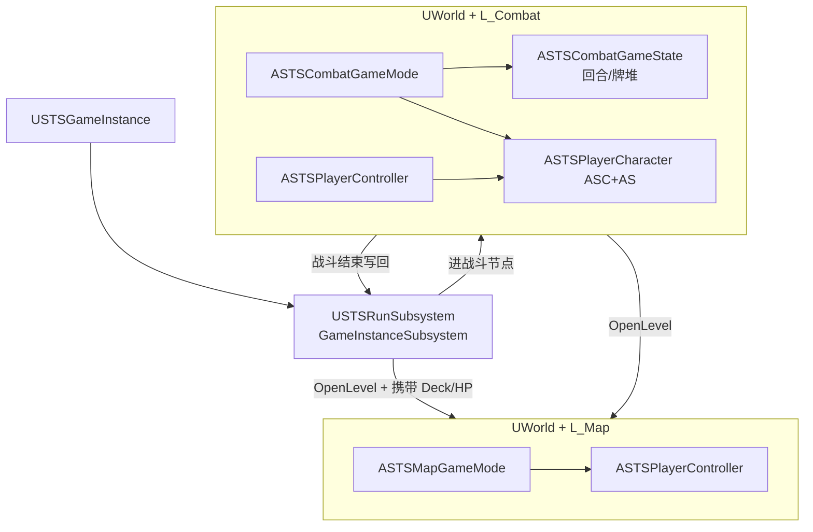

### 0.2 为什么不把所有东西塞进一个 Manager？

| 数据 | 应用哪种 UE 模式 | 原因 |
|------|------------------|------|
| 整局牌组、遗物、金币 | **GameInstance + Subsystem** | 跨 `OpenLevel` 必须存活 |
| 本场手牌、抽弃牌堆、回合 | **GameState** | 官方「当前对局状态」；随战斗 World 销毁 |
| 本场 HP/格挡/能量/Buff | **ASC + AttributeSet**（在 Pawn 上） | GAS 标准位置 |
| 卡牌静态定义 | **DataAsset**（Content） | 非运行时对象 |

**学习要点：** `CombatManager` 逻辑实现为 **`ASTSCombatGameState` 子类**（或组件挂在 GameState 上），不再使用与引擎平行的自定义「全局 Manager 单例」。

### 0.3 关卡与 GameMode 配置

| 地图资产 | GameMode（`DefaultEngine.ini` 或 World Settings） | GameState | 职责 |
|----------|-----------------------------------------------------|-----------|------|
| `L_MainMenu` | `ASTSMainMenuGameMode` | 默认即可 | 新 Run / 继续 |
| `L_Map` | `ASTSMapGameMode` | 可选 `ASTSMapGameState` | 显示地图；数据读 `RunSubsystem` |
| `L_Combat` | `ASTSCombatGameMode` | **`ASTSCombatGameState`** | 生成敌人、驱动回合与牌堆 |

切换示例：

```
MainMenu → RunSubsystem.NewRun() → OpenLevel("L_Map")
L_Map 选战斗节点 → OpenLevel("L_Combat?Encounter=DA_Encounter_Cultist")
战斗结束 → RunSubsystem.ApplyCombatResult() → OpenLevel("L_Map")
```

### 0.4 卡牌数据存放（配合 UE 分层）

| 数据 | 存放位置 | UE 类型 |
|------|----------|---------|
| 卡定义（含升级效果） | Content | `USTSCardData` : `UPrimaryDataAsset` |
| 角色卡池 | Content | `USTSCharacterData` 内数组 |
| **本局已拥有牌组** | `USTSRunSubsystem` | `TArray<FSTSCardInstance>` |
| 是否永久升级 `+` | `FSTSCardInstance` 字段 | 在 RunSubsystem 的 Deck 里 |
| **战斗内手牌/牌堆** | `ASTSCombatGameState` | 开战从 RunSubsystem.Deck **拷贝** |
| 战后三选一候选 | 临时变量在 Map GameMode 或 RunSubsystem | 不持久存「未获取列表」 |

### 0.5 ASC 与 AS 各放什么（复习）

| **ASC**（在 Character/Pawn 上） | **AttributeSet** |
|-----------------------------------|------------------|
| 已授予 GA（PlayCard、RelicListener…） | Health / MaxHealth |
| Active GameplayEffects（易伤、力量） | Block、Energy（玩家） |
| Granted GameplayTags | Poison、Strength 等 |
| **不存牌组** | **不存牌组** |

### 0.6 与框架插件的分工

- **STSFramework 插件**：GAS 类、DataAsset 类型、`ASTSCombatGameState` 基类逻辑（可复用）
- **unrealSTS 游戏模块**：`USTSGameInstance`、`ASTS*GameMode` 蓝图或 C++ 子类
- **Content/STS**：`L_*` 关卡、`WBP_*` UI、`DA_*` 数据

---

## 一、杀戮尖塔核心设计（需复现的机制）

### 1.1 战斗层（GAS 主战场）

| 机制 | 设计要点 | 初版简化 |
|------|----------|----------|
| 回合制 | 玩家回合 → 敌人回合循环，战斗结束判胜负 | 完整实现 |
| 能量 | 每回合重置为 3，卡牌消耗能量才能打出 | 固定 3，暂不做遗物改能量 |
| 牌堆 | 抽牌堆 / 弃牌堆 / 消耗堆，回合结束手牌全弃 | 完整实现 |
| 格挡 | 本回合减伤，**玩家回合开始时清零** | 完整实现 |
| 伤害管线 | 基础伤害 → 力量加成 → 易伤(×1.5) → 虚弱(×0.75) → 格挡吸收 | 力量可先省略，保留易伤/虚弱 |
| 状态效果 | 中毒(回合末跳伤)、易伤、虚弱等 | 3 种：Poison / Vulnerable / Weak |
| 能力牌 | Power 卡打出后整场战斗持续生效 | 1–2 张示例（如「每回合 +1 格挡」） |
| 敌人意图 | 下回合行动预告（攻击数值、Buff 等） | 2 种意图：Attack / Defend |
| 卡牌升级 | 休息点 Smith，每张卡最多 +1（永久） | 数据结构支持，初版休息点可 Smith 1 张 |
| 状态/诅咒牌 | 战斗内临时牌，多数不可打出 | Tag 预留，初版不做 |

### 1.2 尖塔卡牌体系调研（[Wiki](https://slaythespire.wiki.gg/wiki/Cards)）

**五种卡牌类型（必须用 Tag 区分）：**

| 类型 | 规则要点 | GameplayTag |
|------|----------|-------------|
| **Attack 攻击** | 直接造成伤害，可有次要效果；.pentagonal/锥形底边框 | `Card.Type.Attack` |
| **Skill 技能** | 不能直接造成伤害（毒/间接伤害除外）；矩形边框 | `Card.Type.Skill` |
| **Power 能力** | 整场战斗持续 Buff；**同名 Power 每场只能打出一次** | `Card.Type.Power` |
| **Status 状态** | 战斗内塞入牌组的废牌，战终移除；多数 Unplayable | `Card.Type.Status` |
| **Curse 诅咒** | 事件获得，跨战斗留存；多数 Unplayable | `Card.Type.Curse` |

另有 **Colorless 无色**（`Card.Pool.Colorless`）：任意角色可获得，机制多样。

**稀有度（影响奖励权重，用 Tag + 数据表）：**

| 稀有度 | Tag | 普通战基础概率 |
|--------|-----|----------------|
| Common | `Card.Rarity.Common` | 60% |
| Uncommon | `Card.Rarity.Uncommon` | 37% |
| Rare | `Card.Rarity.Rare` | 3%（有保底偏移机制，初版可简化） |
| Basic 起手 | `Card.Rarity.Basic` | 不在奖励池 |
| Special | `Card.Rarity.Special` | 特殊来源（Shiv 等） |

**升级体系（框架必须预留）：**

| 升级类型 | 尖塔行为 | 框架表达 |
|----------|----------|----------|
| **永久升级** | 休息点 Smith，名后缀 `+`，最多 1 次（Searing Blow 例外） | `FSTSCardInstance.bPermanentUpgrade` |
| **战斗内临时升级** | Armaments、Warped Tongs 等，战终还原 | `Card.State.CombatUpgrade` Tag，战终清除 |
| **获得时自动升级** | Molten Egg / Toxic Egg / Frozen Egg | 遗物 Effect：`AutoUpgradeOnGain` + Filter Tag |
| **升级效果** | 通常加数值或减费 | `CardData.BaseEffects` vs `CardData.UpgradedEffects` |

**关键词 Tag（卡牌行为修饰，可组合）：**

`Card.Keyword.Exhaust` / `Ethereal` / `Retain` / `Unplayable` / `Innate` / `XCost`

这些 Tag 供 GA_PlayCard 的 `CanActivate`、CombatManager 弃牌逻辑、遗物 Filter 统一查询。

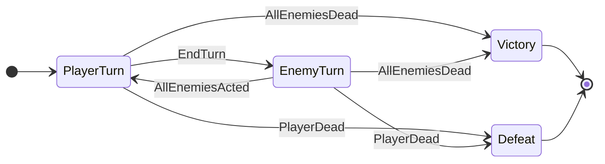

### 1.3 元游戏层（蓝图 + 数据驱动为主）

#### 1.3.1 三幕大关 × 地图小关 × UE Level（分层设计）

尖塔一局 Run = **3 幕（大关）**；每幕有一张 **分叉地图**；地图上每个 **节点（小关）** 是一种遭遇类型。**三者都不是「一个节点一个 umap」**。

| 层级 | 尖塔含义 | 实现方式 | 生命周期 |
|------|----------|----------|----------|
| **幕 Act** | 第 1/2/3 幕，击败 Boss 进入下一幕 | `USTSRunSubsystem::CurrentAct` + `GenerateMapForAct()` | 整局 Run |
| **节点 Node** | 地图上单个可点击点（战/店/火/精英/Boss） | `FSTSMapGraph` / `FSTSMapNode` | 当前幕内 |
| **UE Level** | 真正加载的场景 | 仅 **`L_MainMenu` / `L_Map` / `L_Combat`** 复用 | `OpenLevel` 时切换 |

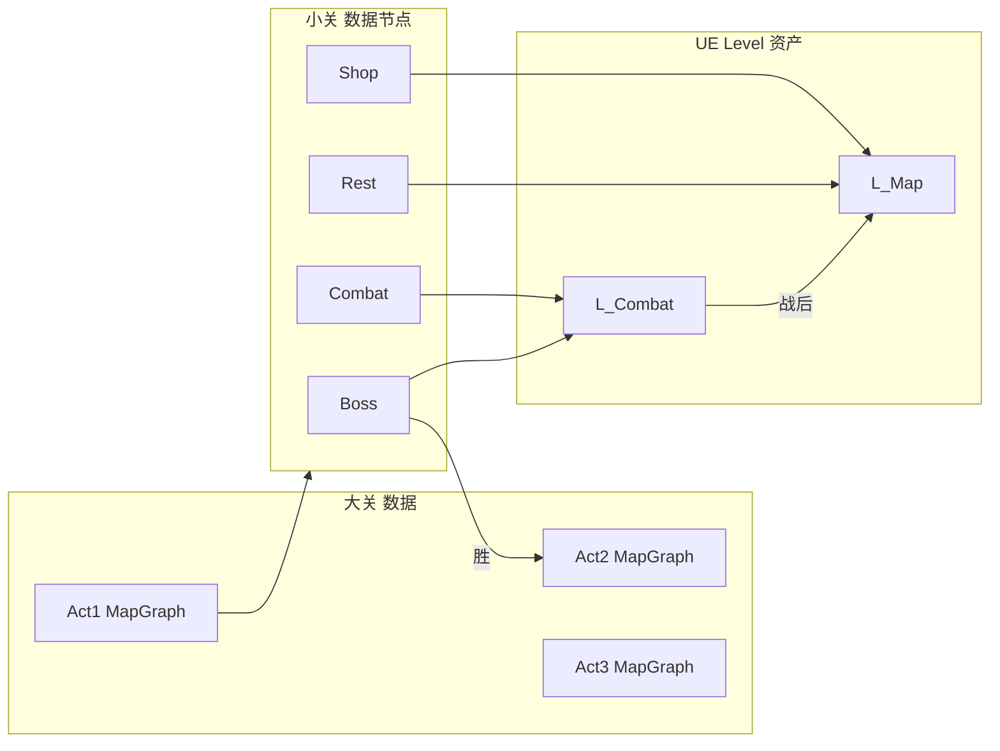

**节点进入分支（`USTSRunSubsystem::EnterNode`）：**

| `ESTSMapNodeType` | 行为 |
|-------------------|------|
| Combat / Elite | `OpenLevel(L_Combat?Encounter=...)`，参数写入 `PendingEncounter` |
| Boss | 同上；胜利后 `AdvanceAct()` → 若 `CurrentAct < 3` 则 `GenerateMapForAct(++Act)` 并刷新 `WBP_Map` |
| Shop / Rest / Treasure | 留在 `L_Map`，CommonUI Push `WBP_Shop` / `WBP_RestSite` |
| （胜利第 3 幕 Boss） | `OpenLevel(L_Victory)` 或弹窗后回主菜单 |

**关键 C++ 类型（STSFramework/Run）：**

- `FSTSMapNode` — 节点 ID、层、类型、出边、`USTSEncounterData*`
- `FSTSMapGraph` — `ActIndex` + 节点数组 + `BossNodeId`
- `USTSActConfigData`（可选 DataAsset）— 每幕敌人池、层数、奖励倍率
- `USTSMapGenerator` — 程序化生成尖塔式多层分叉图（v0.1 可手写 JSON/DataTable）

**v0.1 与完整版：**

| 版本 | 幕数 | 每幕节点 | 说明 |
|------|------|----------|------|
| v0.1 | 仅 Act 1 | 8 节点 | 结构预留 `CurrentAct`，内容只填第一幕 |
| 完整 | Act 1→3 | 每幕 ~12–15 层 | 同一套 `L_Map` + `L_Combat`，换遭遇池与 UI 主题 |

概念详解见 [DOC/ue_concepts_for_sts.md §2.10](../DOC/ue_concepts_for_sts.md)。

#### 1.3.2 元游戏系统表

| 系统 | 设计要点 | 初版内容量 |
|------|----------|------------|
| 地图 | 分支节点、选路前进，节点类型决定遭遇；**三幕共用 `L_Map`** | v0.1：Act 1 共 8 节点、2 条路径汇合到 Boss |
| 战斗奖励 | 战后选 1 张卡加入牌组 | 3 选 1，卡池 15 张 |
| 商店 | 花金币买卡 / 遗物 | 各 1 个货架位，固定价格 |
| 休息点 | 回血或升级卡牌 | 回血 30% MaxHP + Smith 升级 1 张卡 |
| 遗物 | 被动修饰，整局生效 | 5 个遗物，部分用 GAS 被动 Ability 实现 |
| 金币 | 战斗/事件获得，商店消费 | 简化数值 |

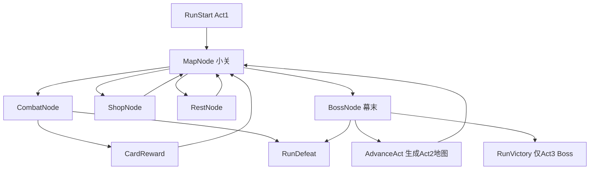

---

## 二、GAS 框架与在本项目中的用法

### 2.1 GAS 核心四件套

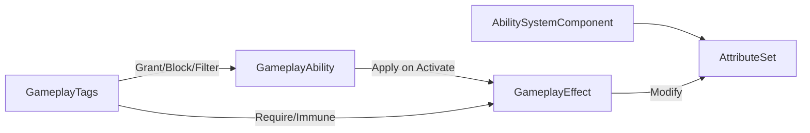

| 组件 | 职责 | 在本项目中 |
|------|------|------------|
| **AttributeSet** | 可复制数值属性（HP、格挡、能量） | `USTSAttributeSet`：Health, MaxHealth, Block, Energy |
| **GameplayEffect** | 修改属性、挂 Tag、持续/瞬时 | 伤害、格挡、中毒 DoT、状态持续时间 |
| **GameplayAbility** | 可激活的技能逻辑 | **少量通用 GA**（打牌/敌人意图/遗物触发）；卡牌内容用 DataAsset 描述，不靠一卡一 GA |
| **GameplayTags** | 状态/类型/阶段标记 | 卡牌类型、状态、回合阶段、目标类型 |
| **ASC** | 挂载在战斗角色上，管理上述全部 | Player / Enemy 共用基类 Character |

### 2.2 卡牌架构：一卡一 GA 不可行，正确做法是「通用 GA + 数据驱动效果」

完整尖塔有 **350+ 张卡**，若每张卡一个 `UGameplayAbility` 子类，维护成本爆炸，也与 GAS 设计初衷不符。GAS 的标准做法是：

- **GA 管流程**（能不能打、扣能量、选目标、触发时机）
- **GE 管数值与状态**（伤害、格挡、中毒层数）
- **DataAsset 管内容**（这张卡由哪些效果组成、各效果 magnitude 是多少）

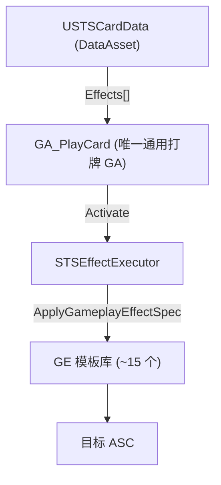

**分层职责：**

| 层 | 数量级 | 职责 |
|----|--------|------|
| `GA_PlayCard` | **1 个**（C++） | 校验回合/能量/目标 → 扣费 → 遍历效果列表 → 调用 Executor |
| `GA_EnemyAction` | **1 个** | 读 Intent 数据，复用同一套 Executor |
| `GA_RelicPassive` | **~5 个原型** | 按触发时机分类（战斗开始/打出攻击牌/回合结束），非按遗物数量 |
| `GE_*` 模板 | **~15 个** | `GE_Damage`、`GE_Block`、`GE_ApplyPoison`、`GE_DrawCards`… 用 SetByCaller 传 magnitude |
| `USTSCardData` | **N 张卡** | 费用、类型、目标、效果描述数组——**加新卡只新建 DataAsset，不新建 GA** |
| 例外：复杂卡 | **<5%** | 如「手牌全是攻击才能打出」→ 单独 `USTSCardCondition` 或极少数 `GA_Card_Special` 子类 |

**一张典型卡的数据长什么样（示意）：**

```cpp
// USTSCardData — Strike
Cost = 1
CardType = Attack
TargetType = SingleEnemy
Effects = [
  { EffectType::Damage, Magnitude = 6 },
]
// Bash — 多效果组合，仍是同一张 DataAsset，无需新 GA
Effects = [
  { EffectType::Damage, Magnitude = 8 },
  { EffectType::ApplyStatus, StatusTag = Vulnerable, Magnitude = 2 },
]
```

**学习价值不变：** 你仍然学 GAS 的核心——Attribute、GE Spec、GA 激活链；只是卡牌 **内容扩展走数据管线**，与商业卡牌游戏常见架构一致。

### 2.3 效果执行器（STSEffectExecutor）

C++ 实现一个 `ExecuteCardEffects(CardData, Source, Target)` 分发器，按 `E_STSEffectType` 枚举 switch：

- `Damage` → 构建 `GE_Damage` Spec，SetByCaller("Damage", Magnitude) → ApplyToTarget
- `Block` → `GE_Block`
- `ApplyStatus` → `GE_Status_Vulnerable` 等
- `DrawCards` / `GainEnergy` → 调 CombatManager，不走 GE（牌堆/能量非 ASC 职责）
- `RepeatPerHit` / `ConditionalBranch` → v0.2 扩展；初版可不做

> **90% 的卡 = 填 DataAsset；9% = 组合已有效果；1% = 写条件类或特殊 GA。**

### 2.4 回合制适配要点（非实时动作游戏）

GAS 默认按帧 Tick，回合制需加 **阶段门控**：

1. **`ASTSCombatGameState`**（`AGameStateBase` 子类，学习项目优先于自定义 Manager 单例）持有 `Phase.PlayerTurn / EnemyTurn` Tag。
2. 仅在 `PlayerTurn` 时允许玩家 ASC `TryActivateAbility`（卡牌 GA）。
3. 敌人回合由 Manager 依次对敌人 ASC 激活预注册的 Intent GA。
4. 回合边界事件（回合开始/结束）统一广播，用于：抽牌、清格挡、中毒结算、能量重置——通过 **GE 移除** 或 **ExecuteGameplayCue** 完成。

> 学习价值：理解 GAS 不仅是「按键放技能」，而是 **任何可授权、可计费、可预测的游戏行动** 都可建模为 Ability。

---

## 三、GAS ↔ 杀戮尖塔 映射表

| 尖塔概念 | GAS 实现 | 实现层 |
|----------|----------|--------|
| 玩家 HP | `Health` / `MaxHealth` Attribute | C++ AttributeSet |
| 格挡 | `Block` Attribute，回合开始 GE 置 0 | C++ GE + CombatManager 触发 |
| 能量 | `Energy` Attribute，回合开始 GE 设为 3 | C++ GE |
| 打出攻击牌 | 通用 `GA_PlayCard` + `USTSCardData.Effects` | C++ GA + DataAsset，Executor 应用 GE |
| 易伤/虚弱/中毒 | 持续 GE + `Status.*` Tag | C++ GE 模板，蓝图配数值 |
| 力量/敏捷 | Modifier GE on Damage Calc | v0.2（初版可跳过） |
| 遗物「战斗开始 +1 能量」 | `GA_RelicListener` + `USTSRelicData.Effects` | 遗物数据驱动，与卡牌共用 Executor |
| 敌人下回合攻击 12 | Intent 数据 + `GA_EnemyAttack` | 蓝图敌人 + Intent 组件 |

### 伤害结算建议（C++ 工具函数 + GE 应用）

在 [`Source/STS/Private/Combat/STSDamageExecution.cpp`](Source/STS/Private/Combat/STSDamageExecution.cpp)（或 `CalcDamage` 静态库）中集中处理：

```
FinalDamage = BaseDamage
  × (TargetHas Vulnerable ? 1.5 : 1.0)
  × (SourceHas Weak ? 0.75 : 1.0)
BlockAbsorbed = min(Target.Block, FinalDamage)
HealthDamage = FinalDamage - BlockAbsorbed
```

再用 `GE_ApplyDamage` 修改 Target 的 Health 与 Block Attribute。

---

## 三之一、遗物系统设计（代表案例 + 数据驱动）

遗物与卡牌共用同一原则：**遗物内容 = DataAsset，效果 = `F_STSCardEffect[]`，执行 = `STSEffectExecutor`**。区别仅在于 **触发时机、条件、计数器**。

### 3.1.1 尖塔遗物分类（按触发机制）

| 触发原型 | 尖塔代表遗物 | 初版是否实现 |
|----------|-------------|-------------|
| `CombatStart` 战斗开始 | 蛇之戒指、锚、金刚杵、青铜鳞片 | 是（3 个） |
| `PlayerTurnEnd` 玩家回合结束 | 奥利哈钢 | 是（1 个） |
| `CombatVictory` 战斗胜利 | 燃烧之血、骨头上的肉 | 是（1 个） |
| `OnCardPlayed` 打出牌时 | 开信刀、双截棍、墨水瓶 | v0.2（需计数器） |
| `DamagePipeline` 伤害管线修饰 | 笔尖（每第 10 次攻击翻倍） | v0.2（需 Modifier 钩子） |
| `PassiveAttribute` 整场被动属性 | 奇怪蘑菇/smooth stone 等 | v0.2（常驻 GE） |

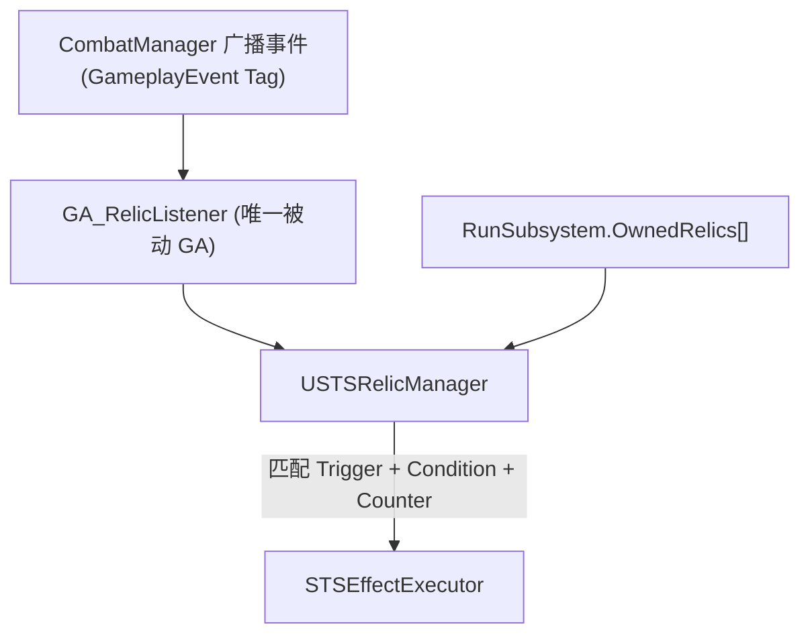

### 3.1.2 数据结构与运行时状态

**`USTSRelicData`（PrimaryDataAsset，一个遗物一条）：**

```cpp
UCLASS()
class USTSRelicData : public UPrimaryDataAsset {
    // 展示
    FText DisplayName;
    FText Description;
    UTexture2D* Icon;

    // 触发
    FGameplayTag TriggerTag;           // Relic.Trigger.CombatStart 等
    FGameplayTagContainer FilterTags;  // 可选：Card.Type.Skill（开信刀用）

    // 条件（初版 2 种就够）
    E_STSRelicCondition Condition;     // None / BlockIsZero / HPPercentLE
    float ConditionParam;              // 如 0.5 表示 50% HP

    // 计数器（开信刀、笔尖、双截棍用，初版可先不启用）
    bool bUseCounter;
    int32 CounterThreshold;            // 如 3、10
    E_STSCounterScope CounterScope;      // PerTurn / PerCombat

    // 效果——与卡牌完全相同的结构体数组
    TArray<F_STSCardEffect> Effects;
};
```

**`USTSRelicManager`（战斗内组件，挂 CombatManager 或 Player ASC）：**

```cpp
// 运行时计数：遗物实例 → 当前计数
TMap<USTSRelicData*, int32> CounterState;

void ProcessEvent(FGameplayTag EventTag, const F_STSRelicEventContext& Context);
// Context 携带：打出的 CardData、当前 Target、Source ASC 等
```

**`GA_RelicListener`（唯一遗物被动 GA，学 GAS 用）：**

- `ActivationPolicy = Passive`，战斗开始时由 Player ASC `GiveAbility` 一次。
- 内部用 `UAbilityTask_WaitGameplayEvent` 监听 `Event.Combat.*` / `Event.Turn.*` / `Event.Card.Played`。
- 收到事件 → 调 `RelicManager::ProcessEvent`。**不为每个遗物单独 GiveAbility。**

### 3.1.3 代表遗物逐项设计（8 个典型案例）

以下 8 个覆盖尖塔遗物的主流模式；**初版 v0.1 实现前 5 个**，后 3 个写入数据结构预留位。

---

#### ① 燃烧之血 Burning Blood（战终回血）

| 字段 | 值 |
|------|-----|
| 稀有度 | 起手遗物（铁甲战士） |
| TriggerTag | `Relic.Trigger.CombatVictory` |
| Condition | `None` |
| Effects | `[{ Heal, 6 }]` |

**流程：** `CombatManager` 判定胜利 → `SendGameplayEvent(Event.Combat.Victory)` → RelicManager 匹配 → Executor 对 Player ASC 应用 `GE_Heal(6)`。

**GAS 点：** 回血走 GE 改 `Health` Attribute，与卡牌伤害对称。

---

#### ② 蛇之戒指 Ring of the Snake（开战多抽牌）

| 字段 | 值 |
|------|-----|
| TriggerTag | `Relic.Trigger.CombatStart` |
| Effects | `[{ DrawCards, 2 }]` |

**流程：** 战斗初始化、首回合抽牌 **之前** 触发 → Executor 调 `CombatManager::DrawCards(2)`。

**GAS 点：** 抽牌不属于 ASC 职责，Executor 内按 `EffectType` 分流——**GE 管属性，Manager 管牌堆**（与卡牌设计一致）。

---

#### ③ 锚 Anchor（开战获得格挡）

| 字段 | 值 |
|------|-----|
| TriggerTag | `Relic.Trigger.CombatStart` |
| Effects | `[{ Block, 10 }]` |

**流程：** 战斗开始 → `GE_Block` SetByCaller(10) → Apply 到 Player ASC。

**GAS 点：** 与 Defend 卡完全相同的效果路径，证明遗物/卡牌共用 Executor。

---

#### ④ 金刚杵 Vajra（开战获得力量）

| 字段 | 值 |
|------|-----|
| TriggerTag | `Relic.Trigger.CombatStart` |
| Effects | `[{ ApplyStatus, Magnitude=1, StatusTag=Status.Strength }]` |

**流程：** 应用 `GE_Status_Strength`（Duration = 整场战斗，到期由 `CombatEnd` 统一 Remove）。

**GAS 点：** 持续 Buff 用 **Infinite Duration GE + CombatEnd 移除**，而非为力量单独写 GA。

---

#### ⑤ 奥利哈钢 Orichalcum（回合末无格挡则 +6 格挡）

| 字段 | 值 |
|------|-----|
| TriggerTag | `Relic.Trigger.PlayerTurnEnd` |
| Condition | `BlockIsZero` |
| Effects | `[{ Block, 6 }]` |

**流程：** 玩家点「结束回合」→ 清手牌弃牌等逻辑之后、切敌人回合之前 → 读 Player `Block` Attribute → 若 ≤ 0 → Apply `GE_Block(6)`。

**GAS 点：** **Condition 在 RelicManager 里查 Attribute**，不写在 GA 里；GA 只负责传事件。

---

#### ⑥ 开信刀 Letter Opener（一回合打出 3 张技能 → 群体伤害）【v0.2】

| 字段 | 值 |
|------|-----|
| TriggerTag | `Relic.Trigger.OnCardPlayed` |
| FilterTags | `Card.Type.Skill` |
| bUseCounter | true |
| CounterThreshold | 3 |
| CounterScope | `PerTurn` |
| Effects | `[{ DamageAll, 5 }]` |

**流程：** 每次打出 Skill 卡 → 计数 +1 → 满 3 触发 Effects → 计数归零（或 modulo）。

**GAS 点：** 计数器放 RelicManager 运行时状态，**不放 GE**；`Event.Card.Played` 的 Payload 带 `CardData` 供 Filter 匹配。

---

#### ⑦ 笔尖 Pen Nib（每第 10 次攻击双倍伤害）【v0.2】

| 字段 | 值 |
|------|-----|
| TriggerTag | `Relic.Trigger.OnCardPlayed` |
| FilterTags | `Card.Type.Attack` |
| bUseCounter | true |
| CounterThreshold | 10 |
| CounterScope | `PerCombat` |
| Effects | `[{ SetDamageMultiplier, 2.0 }]`（特殊效果，仅本次攻击生效） |

**流程：** 打出 Attack 时计数 +1；当计数为 10 的倍数时，在 `STSDamageCalculation` 中读取 `PendingDamageMultiplier`（由 Executor 设置），结算后清除。

**GAS 点：** 这是 **少数不能纯事件+GE 完成的遗物**，需要伤害管线提供 `QueryDamageModifiers()` 钩子；归入「1% 特殊逻辑」，但仍 **不新建遗物 GA**，只扩展 Executor + DamageCalc。

---

#### ⑧ 骨头上的肉 Meat on the Bone（战终低血量大幅回血）【v0.2】

| 字段 | 值 |
|------|-----|
| TriggerTag | `Relic.Trigger.CombatVictory` |
| Condition | `HPPercentLE` |
| ConditionParam | `0.5` |
| Effects | `[{ Heal, 12 }]` |

**流程：** 与燃烧之血同一触发点，但 Condition 检查 `Health/MaxHealth <= 0.5` 才执行。

**GAS 点：** 同一 Trigger 多个遗物可并存，RelicManager **遍历全部遗物** 逐个判断 Condition。

---

### 3.1.4 初版 v0.1 遗物清单（5 个，全部 DataAsset 配置）

| 遗物 | Trigger | Condition | Effects | 验证目标 |
|------|---------|-----------|---------|----------|
| 燃烧之血 | CombatVictory | — | Heal 6 | 事件驱动 + 非战斗 GE |
| 蛇之戒指 | CombatStart | — | DrawCards 2 | Executor 分流到 Manager |
| 锚 | CombatStart | — | Block 10 | 与 Defend 卡共用 GE |
| 金刚杵 | CombatStart | — | Strength 1 | 持续 GE + 战斗结束清理 |
| 奥利哈钢 | PlayerTurnEnd | BlockIsZero | Block 6 | Condition 查 Attribute |

### 3.1.5 加一个新遗物的标准流程（与加卡对称）

1. 新建 `USTSRelicData`，填 TriggerTag + Effects。
2. 若有条件/计数器，勾选 `Condition` / `bUseCounter`。
3. 加入 `RunSubsystem::OwnedRelics`（Boss 掉落、商店购买等）。
4. **无需新建 GA**；下一场战斗 `GA_RelicListener` 自动从 RunSubsystem 读取并生效。

仅当遗物逻辑无法表达为 `Trigger + Condition + Counter + Effects`（如「随机升级一张卡」「修改商店价格」）时，才写 `USTSRelicBehavior` 子类（元游戏层），**战斗内效果仍优先走 Executor**。

### 3.1.6 需要的 GameplayTag 扩展

```ini
; STSGameplayTags.ini（统一 STS. 前缀）
STS.Relic.Trigger.CombatStart / CombatVictory / PlayerTurnStart / ...
STS.Event.Combat.Start / Victory / Defeat
STS.Event.Turn.PlayerStart / PlayerEnd / EnemyStart / EnemyEnd
STS.Event.Card.Played
```

详见 [DOC/gameplay_tags.md](../DOC/gameplay_tags.md)。

CombatManager 在对应时机对 Player ASC 调用 `AbilitySystemComponent::HandleGameplayEvent()`，由 `GA_RelicListener` 统一接收。

---

## 三之二、GameplayTag 分层设计（框架底层）

所有可扩展分类 **优先用 Tag**。定义在 [`Plugins/STSFramework/Config/Tags/STSGameplayTags.ini`](Plugins/STSFramework/Config/Tags/STSGameplayTags.ini)，C++ 用 `FSTSGameplayTags` 访问（对标 Lyra `FLyraGameplayTags`）。

| 类别 | Tag 示例 | 用途 |
|------|----------|------|
| 卡牌类型 | `STS.Card.Type.Attack/Skill/Power/Status/Curse` | 遗物 Filter、UI 边框 |
| 稀有度 | `STS.Card.Rarity.Common/Uncommon/Rare/Basic` | 奖励池加权 |
| 卡池 | `STS.Card.Pool.Ironclad/Colorless` | 角色奖励筛选 |
| 运行时 | `STS.Card.State.Upgraded/CombatUpgrade` | 升级分支 |
| 关键词 | `STS.Card.Keyword.Exhaust/Ethereal/Unplayable` | 出牌/弃牌逻辑 |
| 状态 | `STS.Status.Poison/Vulnerable/Strength` | GE Granted Tag |
| 阶段/事件 | `STS.Phase.PlayerTurn` / `STS.Event.Card.Played` | GA 门控、遗物 |
| SetByCaller | `STS.Data.Damage/Block/Heal` | GE 传参 |

**卡牌实例（支持升级）：** 牌堆存 `FSTSCardInstance{ CardData, bPermanentUpgrade, bCombatUpgrade }`；`GetActiveEffects()` 根据升级状态返回 `BaseEffects` 或 `UpgradedEffects`。`USTSCardData` 含 `CardTypeTag`、`RarityTag`、`KeywordTags`、`BaseCost/UpgradedCost`、双 Effects 数组。

**Power 限打 1 次：** 打出后 ASC 授予 `STS.Granted.Power.{CardId}` Tag；`GA_PlayCard::CanActivate` 检查。

---

## 三之三、Buff 系统设计（GAS 原生实现）

> **GAS 完全可以实现这套 Buff 系统。** 之前提到的 `StatusComponent` 是可选的薄封装，**不是**因为 GAS 做不到。本项目以 **GAS 原生方案为主**：Buff = **Active GameplayEffect（层数/Tag）+ Attribute 修改 + 回合 GameplayEvent 驱动衰减**，充分发挥 GE/AS/GA/Tag 的能力。

参考 [Combat Mechanics Wiki](https://slay-the-spire.fandom.com/wiki/Combat_Mechanics)：尖塔 Buff 分强度型、持续型、布尔型，衰减时机不同。回合制下 **不用 GE 的实时 Period Tick**，改为 **回合事件手动驱动**——这是 GAS 在回合游戏中的标准做法，并非绕过 GAS。

### 3.3.1 尖塔 Buff 分类（框架必须支持）

| 类型 | 代表 | 堆叠方式 | 衰减时机 | 影响 |
|------|------|----------|----------|------|
| **强度型 Intensity** | Strength、Poison、Dexterity、Artifact、Thorns | 层数相加 | Poison：回合**开始**跳伤后 -1；Strength 战终清 | 伤害/格挡/反伤等 flat 加成 |
| **持续型 Duration** | Vulnerable、Weak、Frail | 回合数相加 | 受影响者回合**结束** -1 层 | 乘算修饰（易伤 ×1.5、虚弱 ×0.75） |
| **布尔型 None** | Barricade、Minion、Entangled | 有/无 | 条件移除 | 规则开关（格挡不清除等） |
| **Power 能力牌** | Metallicize、Footwork | 每场限 1 次打出 | 战终移除 | 整场被动，本质是可叠加的 Intensity/Duration Buff |

**伤害管线顺序**（与 Wiki 一致，写在 `STSDamageCalculation`）：

```
BaseDamage
  + Strength（攻击方，flat 加法）
  × Vulnerable（受击方，×1.5）
  × Weak（攻击方，×0.75）
  → 取整
  → 格挡吸收
  → 扣 HP
```

### 3.3.2 常见误解：GAS 做不了回合 Buff？

| 误解 | 事实 |
|------|------|
| GE Duration 是秒，尖塔是回合，所以 GAS 不行 | **回合结束时手动减 Stack / Remove Active GE** 即可；不必依赖 Period Tick |
| 每种 Buff 要一个 GA | 只需 **1 个 `GA_StatusTurnHandler`** 处理所有回合衰减/跳伤 |
| 伤害修饰 GAS 管不了 | 用 **`UGameplayEffectExecutionCalculation`**（`USTSDamageExecution`）读 Tag/Attribute |
| 需要自建 Buff 容器 | **ASC 的 `ActiveGameplayEffectsContainer` 就是 Buff 容器** |

### 3.3.3 GAS 原生架构

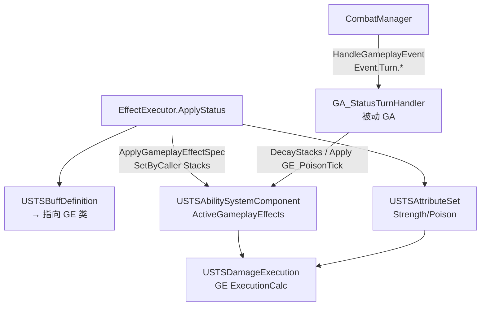

| GAS 组件 | Buff 职责 |
|----------|-----------|
| **GE 模板** | 每种 Buff 一个 GE 蓝图：`Granted Tag` + `Stack Count` + 可选 `Asset Tag`（如 `Status.Decay.OnTurnEnd`） |
| **AttributeSet** | 强度型数值：`Strength`、`Poison`（GE Modifier 写入） |
| **ASC** | 持有所有 Active GE；提供 `DecayEffectStacks()` / `GetEffectStacks(Tag)` |
| **ExecutionCalculation** | `GE_Damage` 内读双方 Tag/Attribute，算易伤/虚弱/力量 |
| **GA_StatusTurnHandler** | 监听 `Event.Turn.Start/End`，驱动中毒跳伤与持续 Debuff 减层 |
| **GameplayTag** | `STS.Status.*` 标识；`Status.Decay.OnTurnStart/OnTurnEnd` 标记衰减时机 |
| **BuffDefinition** | DataAsset **仅作注册表**：Tag → GE 类 + 元数据，**不另建运行时数组** |

### 3.3.4 三类 Buff 的 GAS 实现方式

| 类型 | GAS 实现 | 示例 |
|------|----------|------|
| **强度型** | `GE_ModifyAttribute`（Instant 或 Infinite）改 `Strength`/`Poison` Attribute；Stacking=Aggregate | 金刚杵 +1 Strength |
| **持续型** | `GE_Status_*`：Duration=**Infinite**，**Stack Count=回合数**，Granted Tag=`Status.Vulnerable`，Asset Tag=`Status.Decay.OnTurnEnd` | Bash 易伤 2 回合 |
| **跳伤型** | Poison 存 `Poison` Attribute；回合开始 `GA_StatusTurnHandler` Apply `GE_PoisonTick`（Instant + ExecutionCalc） | 毒卡 |
| **布尔型** | Infinite GE + Granted Tag `Status.Barricade`，无 Stack | 壁垒 |

**GE_Status_Vulnerable 蓝图配置要点：**
- Duration Policy = **Infinite**（战斗内不过期，靠 Stack 归零移除）
- Stack Count = SetByCaller `Data.Stacks`（2 层 = 2 回合）
- Stacking Type = **AggregateByTarget**（再次施加则层数相加）
- Granted Tags = `STS.Status.Vulnerable`
- Asset Tags = `STS.Status.Decay.OnTurnEnd`（标记衰减时机）
- Gameplay Cue = 易伤视觉特效

### 3.3.5 USTSBuffDefinition（注册表 → 指向 GE，不存运行时）

```cpp
UCLASS(BlueprintType)
class USTSBuffDefinition : public UPrimaryDataAsset {
    FGameplayTag BuffTag;
    TSubclassOf<UGameplayEffect> GameplayEffectClass;  // GE_Status_Vulnerable
    E_STSStackType StackType;
    FGameplayTag DecayEventTag;    // Status.Decay.OnTurnEnd
    bool bBlockedByArtifact;
    FText DisplayName;
    UTexture2D* Icon;
};
```

运行时状态 **只在 ASC 的 ActiveEffects 和 AttributeSet 中**，BuffDefinition 仅是静态查找表。

### 3.3.6 ApplyStatus（纯 GAS 路径）

```cpp
void USTSEffectExecutor::ApplyStatus(USTSAbilitySystemComponent* SourceASC,
    USTSAbilitySystemComponent* TargetASC, FGameplayTag StatusTag, float Stacks)
{
    USTSBuffDefinition* Def = BuffRegistry->Find(StatusTag);

    // Artifact：GAS 查 Active GE
    if (Def->bBlockedByArtifact && TargetASC->GetEffectStacks(TAG_Status_Artifact) > 0) {
        TargetASC->RemoveEffectStacks(TAG_Status_Artifact, 1);
        return;
    }

    FGameplayEffectSpecHandle Spec = SourceASC->MakeOutgoingSpec(
        Def->GameplayEffectClass, 1, SourceASC->MakeEffectContext());
    Spec.Data->SetSetByCallerMagnitude(TAG_Data_Stacks, Stacks);
    TargetASC->ApplyGameplayEffectSpecToTarget(*Spec.Data.Get(), TargetASC);
}
```

### 3.3.7 伤害修饰：USTSDamageExecution（GAS 正统）

```cpp
// GE_Damage 绑定 USTSDamageExecution
void USTSDamageExecution::Execute_Implementation(...) const {
    float Damage = GetSetByCallerMagnitude(TAG_Data_Damage);
    // 攻击方
    Damage += GetSourceAttribute(Strength);
    if (SourceASC->HasMatchingGameplayTag(TAG_Status_Weak))
        Damage *= 0.75f;
    // 受击方
    if (TargetASC->HasMatchingGameplayTag(TAG_Status_Vulnerable))
        Damage *= 1.5f;
    Damage = FMath::FloorToFloat(Damage);
    // 写回 OutExecutionOutput → 改 Health/Block Attribute
}
```

伤害管线完全在 **GE ExecutionCalculation** 内完成，是学 GAS 的核心路径。

### 3.3.8 回合衰减：GA_StatusTurnHandler（第 4 个通用 GA）

```cpp
// 被动 GA，AbilitySet 授予玩家和敌人
void USTSGameplayAbility_StatusTurnHandler::ActivateAbility(...) {
    WaitGameplayEvent(TAG_Event_Turn_Start, ...).OnTrigger([this]() {
        // Poison：Apply GE_PoisonTick（读 Poison Attribute，跳伤，Attribute-1）
        GetSTSASC()->ApplyTurnStartEffects();
    });
    WaitGameplayEvent(TAG_Event_Turn_End, ...).OnTrigger([this]() {
        // Vulnerable/Weak：对 AssetTag=Status.Decay.OnTurnEnd 的 Active GE 各 -1 Stack
        GetSTSASC()->DecayEffectsByTag(TAG_Status_Decay_OnTurnEnd);
    });
}
```

CombatManager 在回合边界：`ASC->HandleGameplayEvent(Event.Turn.Start/End)` —— **事件驱动，不 Tick**。

| Buff | GAS 触发 | GAS 行为 |
|------|----------|----------|
| Poison | `Event.Turn.Start` → `GE_PoisonTick` | ExecutionCalc 读 `Poison` Attribute，Apply `GE_Damage`，Modifier Poison-1 |
| Vulnerable/Weak | `Event.Turn.End` → `DecayEffectsByTag` | `RemoveActiveGameplayEffect` 或 `SetActiveGameplayEffectLevel(Stack-1)` |
| Strength | `CombatEnd` | `RemoveActiveEffectsWithGrantedTags(Status.Strength)` + 清 Attribute |
| Power 被动 | `CombatEnd` | `RemoveActiveEffectsWithSourceTag(Granted.Power.*)` |

### 3.3.9 Power 卡与 Buff 的关系

Power 卡 ≠ 单独的 Buff 系统，而是 **打出 Power 卡 → `ApplyStatus` 或持续 GE → 战终清除**：

```
打出 GA_PlayCard(Power: Metallicize)
  → Executor: ApplyStatus(Metallicize, 3)   // 回合结束 +3 Block
  → ASC 授予 Tag Granted.Power.Metallicize  // 防止重复打出
```

| Power 示例 | 实现 |
|------------|------|
| Metallicize | Infinite GE + `Event.Turn.End` 时 Apply `GE_Block`；或 AssetTag=Decay.OnTurnEnd 的自定义 GE |
| Footwork | ApplyStatus Dexterity +2，Intensity |
| Demon Form | 每回合开始 ApplyStatus Strength +2（OnTurnStart 钩子里调 Executor） |

复杂 Power（「每打出攻击 +1 力量」）v0.2 用 `USTSPowerBehavior` 子类监听 `Event.Card.Played`，初版只做静态 Buff Power。

### 3.3.10 初版 Buff 清单

| Buff | StackType | 初版 | 来源示例 |
|------|-----------|------|----------|
| Vulnerable | Duration | **是** | Bash |
| Weak | Duration | **是** | 敌人攻击（v0.2） |
| Poison | Intensity+Tick | **是** | 毒卡 |
| Strength | Intensity | **是** | 金刚杵遗物 |
| Dexterity | Intensity | v0.2 | — |
| Frail | Duration | v0.2 | — |
| Artifact | Intensity | v0.2 | 觉醒者 |
| Barricade | Boolean | v0.2 | 壁垒 Power |

### 3.3.11 扩展新 Buff 三步（纯 GAS）

1. 新建 GE 蓝图 `GE_Status_XXX`（配 Granted Tag、Stack、Decay Asset Tag、Cue）
2. 新建 `DA_Buff_XXX` 指向该 GE 类
3. 卡牌 Effects 加 `ApplyStatus`；UI 读 `ASC->GetActiveEffectsWithAllTags(Status.XXX)` 显示层数

### 3.3.12 GA 清单更新（4 个通用 GA）

| GA | 职责 |
|----|------|
| `GA_PlayCard` | 打牌 |
| `GA_EnemyAction` | 敌人 Intent |
| `GA_RelicListener` | 遗物事件 |
| `GA_StatusTurnHandler` | **回合 Buff 衰减/跳伤** |

---

## 四、项目架构：Lyra 启发式插件框架

### 4.0 unrealSTS 现有工程与目标目录结构

#### 4.0.1 当前状态（已扫描）

| 项 | 现状 |
|----|------|
| 工程路径 | [`unrealSTS/unrealSTS.uproject`](unrealSTS/unrealSTS.uproject) |
| 引擎版本 | **UE 5.7** |
| 模板 | Blank C++（仅 `FDefaultGameModuleImpl`） |
| 游戏模块 | `Source/unrealSTS/` |
| GAS 插件 | **未启用** |
| STSFramework 插件 | **未创建** |
| Content | 空目录 `Content/` |
| 杂项 | 仓库内另有 [`我的项目/`](我的项目/) 空工程，**应删除或加入 .gitignore** |

#### 4.0.2 仓库总览

```
F:/unreal_STS/                    ← Git 仓库根
├── README.md
├── .gitignore
└── unrealSTS/                    ← UE 工程根（打开这个 .uproject）
    ├── unrealSTS.uproject
    ├── Config/
    ├── Content/STS/              ← 所有游戏资产放这里
    ├── Plugins/STSFramework/     ← 框架插件（新建）
    └── Source/
        ├── unrealSTS/            ← 游戏模块（薄层）
        ├── unrealSTS.Target.cs
        └── unrealSTSEditor.Target.cs
```

#### 4.0.3 模块职责划分

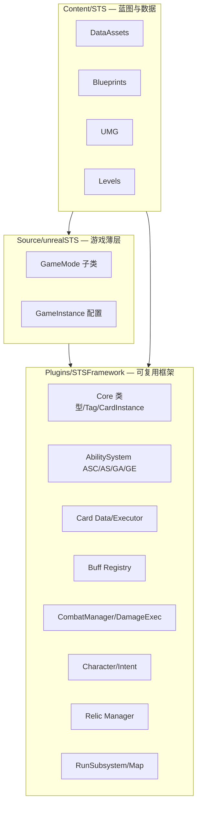

| 放哪 | 放什么 | 不放什么 |
|------|--------|----------|
| **STSFramework 插件** | 全部 C++ 框架类、Tag ini、Buff/Card/Relic 数据结构 | 关卡、UI 贴图、角色模型 |
| **unrealSTS 模块** | `AGameMode` 子类、`AGameInstance`（若需）、编辑器工具 | 业务逻辑、GAS 类 |
| **Content/STS** | 蓝图、DataAsset、GE 蓝图、UMG、地图 | C++ 源码 |

#### 4.0.4 Plugins/STSFramework 详细结构

```
Plugins/STSFramework/
├── STSFramework.uplugin
├── Config/
│   └── Tags/
│       └── STSGameplayTags.ini          # 全部 STS.* Tag 定义
├── Resources/
│   └── Icon128.png
└── Source/STSFramework/
    ├── STSFramework.Build.cs
    ├── Public/
    │   ├── STSFramework.h
    │   ├── Core/
    │   │   ├── STSTypes.h               # 枚举：EffectType, StackType, TargetType...
    │   │   ├── STSCardInstance.h        # FSTSCardInstance
    │   │   └── STSGameplayTags.h        # FSTSGameplayTags 单例
    │   ├── AbilitySystem/
    │   │   ├── STSAbilitySystemComponent.h
    │   │   ├── STSAttributeSet.h
    │   │   ├── STSAbilitySet.h          # Lyra 式 AbilitySet
    │   │   ├── STSGameplayAbility.h
    │   │   └── Abilities/
    │   │       ├── STSGameplayAbility_PlayCard.h
    │   │       ├── STSGameplayAbility_EnemyAction.h
    │   │       ├── STSGameplayAbility_RelicListener.h
    │   │       └── STSGameplayAbility_StatusTurnHandler.h
    │   ├── Card/
    │   │   ├── STSCardData.h
    │   │   ├── STSCardTypes.h           # F_STSCardEffect
    │   │   ├── STSEffectExecutor.h
    │   │   └── STSCardCondition.h
    │   ├── Status/
    │   │   ├── STSBuffDefinition.h
    │   │   └── STSBuffRegistry.h
    │   ├── Combat/
    │   │   ├── STSCombatGameState.h
    │   │   ├── STSCombatTypes.h
    │   │   ├── STSDamageExecution.h
    │   │   ├── STSEnemyIntentComponent.h
    │   │   └── STSEncounterData.h
    │   ├── Character/
    │   │   ├── STSCombatCharacter.h
    │   │   ├── STSPlayerCharacter.h
    │   │   ├── STSEnemyCharacter.h
    │   │   └── STSCharacterData.h
    │   ├── Relic/
    │   │   ├── STSRelicData.h
    │   │   └── STSRelicManager.h
    │   └── Run/
    │       ├── STSRunSubsystem.h
    │       └── STSMapNodeData.h
    └── Private/
        └── （与 Public 镜像，.cpp 实现）
```

**STSFramework.Build.cs 依赖：**

```csharp
PublicDependencyModuleNames.AddRange(new string[] {
    "Core", "CoreUObject", "Engine", "GameplayTags", "GameplayTasks",
    "GameplayAbilities", "UMG", "NetCore"  // NetCore 为 GAS 所需
});
```

#### 4.0.5 Source/unrealSTS 游戏模块（薄层）

```
Source/unrealSTS/
├── unrealSTS.Build.cs          # 依赖 STSFramework, UMG
├── unrealSTS.h / .cpp
├── STSGameInstance.h/.cpp      # 可选：挂载 RunSubsystem 测试
└── Game/
    ├── STSCombatGameMode.h/.cpp    # 战斗关卡 GameMode
    ├── STSMapGameMode.h/.cpp       # 地图关卡 GameMode
    └── STSMainMenuGameMode.h/.cpp  # 主菜单（v0.1 可合并）
```

```csharp
// unrealSTS.Build.cs
PublicDependencyModuleNames.AddRange(new string[] {
    "Core", "CoreUObject", "Engine", "STSFramework", "UMG"
});
```

#### 4.0.6 Content/STS 资产目录（蓝图与数据）

```
Content/STS/
├── Characters/
│   ├── Player/
│   │   └── BP_Player_Ironclad.uasset
│   └── Enemies/
│       ├── BP_Enemy_Slime.uasset
│       ├── BP_Enemy_Cultist.uasset
│       └── BP_Enemy_Boss.uasset
├── Data/
│   ├── AbilitySets/
│   │   ├── AS_PlayerCombat.uasset
│   │   └── AS_EnemyCombat.uasset
│   ├── Cards/
│   │   ├── DA_Card_Strike.uasset
│   │   ├── DA_Card_Defend.uasset
│   │   └── DA_Card_Bash.uasset
│   ├── Buffs/
│   │   ├── DA_Buff_Vulnerable.uasset
│   │   ├── DA_Buff_Poison.uasset
│   │   └── DA_Buff_Strength.uasset
│   ├── Characters/
│   │   └── DA_Char_Ironclad.uasset
│   ├── Enemies/
│   │   ├── DA_Enemy_Slime.uasset
│   │   └── DA_Encounter_Cultistx2.uasset
│   ├── Relics/
│   │   └── DA_Relic_BurningBlood.uasset
│   └── Map/
│       └── DA_Map_Chapter1.uasset
├── Effects/                          # GameplayEffect 蓝图
│   ├── GE_Damage.uasset
│   ├── GE_Block.uasset
│   ├── GE_Heal.uasset
│   ├── GE_EnergyCost.uasset
│   ├── GE_Status_Vulnerable.uasset
│   ├── GE_Status_Poison.uasset
│   └── GE_PoisonTick.uasset
├── Blueprints/
│   ├── Combat/
│   │   └── BP_CombatGameState.uasset   # 继承 C++ ASTSCombatGameState
│   └── Run/
│       └── BP_STSGameMode.uasset
├── UI/
│   ├── WBP_CombatHUD.uasset
│   ├── WBP_CardWidget.uasset
│   ├── WBP_StatusBar.uasset
│   ├── WBP_Map.uasset
│   ├── WBP_Shop.uasset
│   └── WBP_RelicBar.uasset
└── Maps/
    ├── L_MainMenu.umap
    ├── L_Map.umap
    └── L_Combat.umap
```

**命名约定：**

| 前缀 | 类型 | 示例 |
|------|------|------|
| `DA_` | PrimaryDataAsset | `DA_Card_Strike` |
| `AS_` | AbilitySet | `AS_PlayerCombat` |
| `GE_` | GameplayEffect | `GE_Status_Vulnerable` |
| `BP_` | Blueprint 类 | `BP_Player_Ironclad` |
| `WBP_` | UMG Widget | `WBP_CombatHUD` |
| `L_` | Level 地图 | `L_Combat` |

#### 4.0.7 unrealSTS.uproject 需添加的插件

```json
"Plugins": [
  { "Name": "GameplayAbilities", "Enabled": true },
  { "Name": "GameplayTags", "Enabled": true },
  { "Name": "GameplayTasks", "Enabled": true },
  { "Name": "STSFramework", "Enabled": true }
]
```

#### 4.0.8 Config 文件补充

| 文件 | 作用 |
|------|------|
| [`Config/DefaultGameplayTags.ini`](unrealSTS/Config/DefaultGameplayTags.ini) | `ImportTagsFromConfig` 指向插件 Tag ini |
| [`Config/DefaultEngine.ini`](unrealSTS/Config/DefaultEngine.ini) | 添加 `GlobalGameplayTags` 或 `GameplayTagsSettings` |
| 插件内 `STSGameplayTags.ini` | 全部 `STS.*` Tag 定义 |

`DefaultGameplayTags.ini` 示例：

```ini
[/Script/GameplayTags.GameplayTagsSettings]
ImportTagsFromConfig=(ConfigFile="STSGameplayTags", Section="STSGameplayTags")
+GameplayTagTableList=/STSFramework/Config/Tags/STSGameplayTags.STSGameplayTags
```

#### 4.0.9 后续扩展：内容插件（v0.2+）

```
Plugins/
├── STSFramework/           # 不变
└── STSContent_Ironclad/    # 铁甲战士卡池、专属 UI 皮肤
    └── Content/STS/Ironclad/
        ├── Data/Cards/
        └── Textures/
```

与 Lyra 的 ShooterCore 分离思路一致：**框架插件稳定，内容插件可插拔**。

#### 4.0.10 Phase 0 落地顺序（针对现有工程）

1. 删除或 gitignore `我的项目/`
2. 创建 `Plugins/STSFramework` 插件骨架（.uplugin + 空模块）
3. 修改 `unrealSTS.uproject` 启用 GAS + STSFramework
4. 更新两个 `Build.cs` 依赖
5. 创建 `Content/STS/` 子目录空文件夹（可用 `.gitkeep` 或编辑器创建）
6. 添加 `STSGameplayTags.ini` + `FSTSGameplayTags` 注册
7. 编译通过后，按 §4.4 类清单逐个添加 C++ 文件

---

### 4.1 借鉴 Lyra 的什么

| Lyra | 本项目 | 初版 |
|------|--------|------|
| `ULyraAbilitySet` | `USTSAbilitySet` | 采用 |
| `ULyraPawnData` | `USTSCharacterData` + AbilitySets | 采用 |
| GameFeature 动态加载 | `USTSRunExperience` | 预留 |
| 双 ASC | 单 ASC on Character | 不采用 |
| InputTag→Ability | UI ActionTag→TryPlayCard | 采用 |

框架代码放 **`unrealSTS/Plugins/STSFramework`**（零 Content 依赖）；`Source/unrealSTS` 只放 GameMode；`Content/STS` 放全部资产；未来卡池可拆 `STSContent_Ironclad` 插件。

### 4.2 USTSAbilitySet

战斗开始：`CharacterData.AbilitySets` → `GiveToAbilitySystem(ASC)` 授予 `GA_PlayCard`、`GA_RelicListener`（玩家）或 `GA_EnemyAction`（敌人）；战斗结束 `Remove`。

### 4.3 引擎依赖

[`unrealSTS.uproject`](unrealSTS/unrealSTS.uproject) 启用 GAS 三件套 + `STSFramework`。[`unrealSTS.Build.cs`](unrealSTS/Source/unrealSTS/unrealSTS.Build.cs) 依赖 `STSFramework`、`UMG`。

### 4.4 C++ 类清单（STSFramework 插件）

| 类 | 路径 | 职责 |
|----|------|------|
| `ASTSCombatCharacter` | `Character/STSCombatCharacter` | 挂 ASC + AttributeSet，玩家/敌人基类 |
| `USTSAbilitySystemComponent` | `AbilitySystem/STSAbilitySystemComponent` | 扩展 ASC：回合门控、卡牌激活入口 |
| `USTSAttributeSet` | `AbilitySystem/STSAttributeSet` | HP / Block / Energy |
| `USTSGameplayAbility` | `AbilitySystem/STSGameplayAbility` | GA 基类 |
| `USTSGameplayAbility_PlayCard` | `AbilitySystem/STSGameplayAbility_PlayCard` | **唯一打牌 GA**：能量消耗、目标校验、调 Executor |
| `USTSGameplayAbility_EnemyAction` | `AbilitySystem/STSGameplayAbility_EnemyAction` | 敌人 Intent 执行，复用 Executor |
| `USTSEffectExecutor` | `Card/STSEffectExecutor` | 读 `F_STSCardEffect` 数组，构建 GE Spec 并 Apply |
| `F_STSCardEffect` | `Card/STSCardTypes.h` | 效果描述结构体：Type / Magnitude / StatusTag / TargetOverride |
| `USTSBuffDefinition` | `Status/STSBuffDefinition` | Tag → GE 类注册表（不存运行时状态） |
| `USTSBuffRegistry` | `Status/STSBuffRegistry` | 查找 BuffDefinition |
| `USTSDamageExecution` | `Combat/STSDamageExecution` | GE ExecutionCalculation，伤害管线 |
| `USTSGameplayAbility_StatusTurnHandler` | `AbilitySystem/...` | 回合事件驱动 Buff 衰减/中毒跳伤 |
| `ASTSCombatGameState` | `Combat/STSCombatGameState` | 继承 `AGameStateBase`；回合状态机、牌堆、胜负（原 CombatManager） |
| `USTSRunGameInstance` 或 `USTSRunSubsystem` | `Run/STSRunSubsystem` | 跨关卡：牌组、遗物、金币、地图进度 |
| `USTSAbilitySet` | `AbilitySystem/STSAbilitySet` | Lyra 式批量授予 GA/GE（角色/战斗初始化） |
| `FSTSCardInstance` | `Core/STSCardInstance.h` | 运行时卡牌实例（含永久/战斗内升级状态） |
| `USTSCardData` | `Card/STSCardData` | PrimaryDataAsset：费用、**Type/Rarity Tag**、BaseEffects + UpgradedEffects |
| `USTSRelicData` | `Relic/STSRelicData` | 遗物 DataAsset：Trigger + Condition + Counter + Effects |
| `USTSRelicManager` | `Relic/STSRelicManager` | 战斗内遍历遗物、查条件/计数、调 Executor |
| `USTSGameplayAbility_RelicListener` | `AbilitySystem/STSGameplayAbility_RelicListener` | **唯一遗物被动 GA**，监听 GameplayEvent |
| `USTSCardCondition` | `Card/STSCardCondition` | 可选：复杂卡出牌条件（基类 + 少量子类） |
| `FSTSMapNode` / `FSTSMapGraph` | `Run/STSMapTypes.h` | 当前幕地图图结构（节点、边、状态） |
| `USTSMapGenerator` | `Map/STSMapGenerator` | 按 Act 生成尖塔式多层分叉图 |
| `USTSActConfigData` | `Map/STSActConfigData` | 每幕遭遇池、Boss、层数配置 |
| `USTSEncounterData` | `Combat/STSEncounterData` | 单场战斗敌人组合（OpenLevel 参数） |
| `USTSMapNodeData` | `Map/STSMapNodeData` | （可选）固定节点模板资产 |

### 4.5 蓝图层清单（学习重点）

```
Content/STS/
  Blueprints/
    Characters/   BP_Player_Ironclad, BP_Enemy_Cultist, BP_Enemy_Slime, BP_Boss
    Abilities/      GA_PlayCard, GA_EnemyAction, GA_RelicListener（各 1 个，一般不改）
    Combat/         BP_CombatGameState, BP_CombatGameMode
    Map/            BP_MapUI, BP_MapGenerator
    UI/             WBP_CombatHUD, WBP_CardHand, WBP_Map, WBP_Shop, WBP_RelicBar
  Data/
    Cards/          DA_Card_Strike, DA_Card_Defend, DA_Card_Bash, ...（纯 DataAsset，无 GA）
    Relics/         DA_Relic_BurningBlood, DA_Relic_SnakeRing, ...（纯 DataAsset）
    Effects/        GE_Damage, GE_Block, GE_Poison, ...（GE 蓝图子类，配 SetByCaller）
    Map/            DA_Map_Chapter1
```

**加一张新卡的标准流程（无需写代码）：**
1. 新建 `USTSCardData` → 设 `CardTypeTag`、`RarityTag`、Cost
2. 填 `BaseEffects`；若有升级填 `UpgradedEffects`
3. 加入卡池或 `FSTSCardInstance` 牌组 → 完成

**升级一张卡：** 休息点 UI 选 `FSTSCardInstance` → `bPermanentUpgrade=true` → 下一场战斗自动带 `Card.State.Upgraded`。

**只有** 卡牌含特殊规则（条件出牌、基于手牌动态伤害）时，才新建 `USTSCardCondition` 子类或 `GA_Card_Special`。

### 4.6 单局循环关卡流

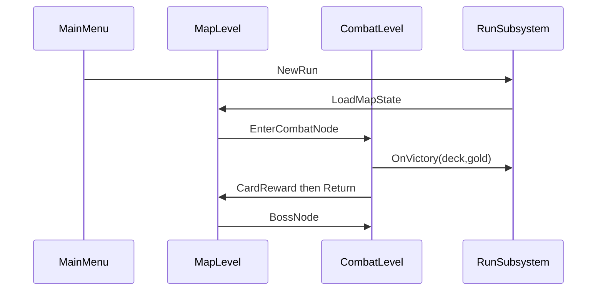

- **Map Level**：UMG 选节点，读 `RunSubsystem` 当前层。
- **Combat Level**：`BP_CombatGameMode` 生成玩家与敌人，初始化牌堆，绑定 HUD。
- 关卡切换用 `OpenLevel` + `RunSubsystem` 持久化（`GameInstance`）。

---

## 四之二、GAS 具体落地：AS / GE / GA / ASC 分工

本节说明 **每个 GAS 组件挂在哪、何时创建、谁调用谁**。尖塔是回合制，没有「按住攻击键持续施法」，但 GAS 仍然负责 **属性、效果、行动授权**。

### 4.2.1 总览：一场战斗中的 GAS 拓扑

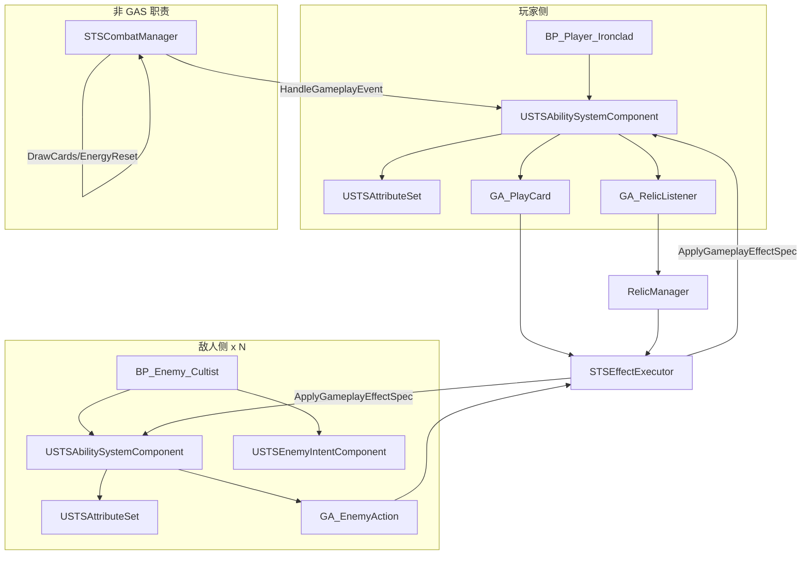

**原则：**
- **每个战斗单位**（玩家 + 每个敌人）各有一套 **ASC + AttributeSet**。
- **牌堆 / 手牌 / 回合阶段** 在 `CombatManager`，不是 ASC 的一部分。
- **所有数值变化**（伤害、格挡、状态）尽量走 **GE**；**所有「一次行动」**（打出牌、敌人出招、遗物监听）走 **GA**。

---

### 4.2.2 AttributeSet（AS）— 只存「当前战斗数值」

**类：** `USTSAttributeSet`（C++，玩家和敌人 **共用同一套**）

| Attribute | 玩家 | 敌人 | 说明 |
|-----------|:----:|:----:|------|
| `Health` | ✓ | ✓ | 当前生命，归零即死亡 |
| `MaxHealth` | ✓ | ✓ | 本场战斗上限；玩家从 RunSubsystem 同步 |
| `Block` | ✓ | ✓ | 格挡值；玩家回合开始时 `GE_ClearBlock` 清零 |
| `Energy` | ✓ | — | 仅玩家使用；敌人不用能量 |
| `Poison` | ✓ | ✓ | 中毒层数（也可用 GE Stack，初版用 Attribute 直观） |
| `Strength` | ✓ | ✓ | 力量层数，伤害管线读取 |

**注册 Replication / 回调（C++ 必做）：**

```cpp
// USTSAttributeSet
void PreAttributeChange(const FGameplayAttribute& Attr, float& NewValue);
void PostGameplayEffectExecute(const FGameplayEffectModCallbackData& Data);
```

- `GE_Damage` 执行时，在 `PostGameplayEffectExecute` 里做：**先扣 Block，再扣 Health**（或集中在 `STSDamageExecution`）。
- `Health` 变化时广播 `OnHealthChanged`，UI 和 CombatManager 监听以判断胜负。

**玩家 vs 敌人 AS 差异：** 不拆两个 AttributeSet 类；敌人 simply 不使用 `Energy`。保持一张表，便于 GE 模板通用。

---

### 4.2.3 GameplayEffect（GE）— 所有「数值变化」的模板

GE 是 **蓝图资产**（继承 C++ 基类或纯蓝图 GE），用 **SetByCaller** 传 magnitude，一张 GE 模板服务几百张卡。

| GE 资产 | Duration | 修改目标 | SetByCaller | 谁触发 |
|---------|----------|----------|-------------|--------|
| `GE_Damage` | Instant | Health↓ Block↓ | `Data.Damage` | Executor / 敌人 Intent |
| `GE_Heal` | Instant | Health↑ | `Data.Heal` | Executor（燃烧之血等） |
| `GE_Block` | Instant | Block↑ | `Data.Block` | Executor（Defend、锚） |
| `GE_EnergyCost` | Instant | Energy↓ | `Data.Cost` | GA_PlayCard 激活时 |
| `GE_EnergyReset` | Instant | Energy=3 | — | CombatManager 回合开始 |
| `GE_ClearBlock` | Instant | Block=0 | — | CombatManager 玩家回合开始 |
| `GE_Status_Vulnerable` | 1 回合或自定义 | 挂 Tag + 层数 | `Data.Stacks` | Executor |
| `GE_Status_Weak` | 1 回合 | 同上 | `Data.Stacks` | Executor |
| `GE_Status_Strength` | Infinite（战终移除） | Strength↑ | `Data.Stacks` | Executor（金刚杵） |

**构建 Spec 的标准代码路径（Executor 内）：**

```cpp
FGameplayEffectContextHandle Ctx = SourceASC->MakeEffectContext();
Ctx.AddSourceObject(SourceActor);

FGameplayEffectSpecHandle Spec = SourceASC->MakeOutgoingSpec(
    GE_Damage_Class, Level, Ctx);
Spec.Data->SetSetByCallerMagnitude(TAG_Data_Damage, Magnitude);

SourceASC->ApplyGameplayEffectSpecToTarget(*Spec.Data.Get(), TargetASC);
```

**持续状态 vs 瞬时：**
- **伤害/格挡/回血** → `Instant` GE。
- **易伤/虚弱** → `Has Duration`（Period=回合数）或回合结束时由 CombatManager `RemoveActiveEffectsWithTag`。
- **力量（战整场）** → `Infinite` + 战斗结束 `RemoveActiveEffectsWithGrantedTags(Status.Strength)`。

**毒伤（回合末跳伤）不走 Tick：** CombatManager 在 `PlayerTurnEnd` / `EnemyTurnEnd` 读 `Poison` Attribute → 手动 Apply `GE_Damage` → 层数 -1。这比 GE Period 更适合回合制。

---

### 4.2.4 GameplayAbility（GA）— 4 个通用 GA

| GA 类 | 授予对象 | 授予时机 | Activate 做什么 |
|-------|----------|----------|-----------------|
| `GA_PlayCard` | 玩家 ASC | 战斗开始 `GiveAbility` | 校验 Tag/能量/目标 → `GE_EnergyCost` → `Executor.Execute(CardData.Effects)` |
| `GA_EnemyAction` | 每个敌人 ASC | 敌人生成时 | 读 `IntentComponent` 当前 Intent → `Executor.Execute(Intent.Effects)` |
| `GA_RelicListener` | 玩家 ASC | 战斗开始 | 被动等待 `GameplayEvent` → 转交 `RelicManager` |
| `GA_StatusTurnHandler` | 玩家 + 敌人 ASC | 战斗开始 | 被动监听 `Event.Turn.*` → Buff 衰减/中毒跳伤（见 §3.3.8） |

**玩家打牌完整调用链：**

```
UI 点击卡
  → CombatManager.TryPlayCard(CardData, TargetEnemy)
    → 检查 Phase.PlayerTurn（ASC 上有 Tag 或 Manager 查）
    → PlayerASC.TryActivateAbility(GA_PlayCard)
      → GA_PlayCard::CanActivateAbility
          检查 Energy >= Cost、目标合法、CardCondition
      → GA_PlayCard::ActivateAbility
          Apply GE_EnergyCost
          EffectExecutor.Execute(CardData.Effects, Player, Target)
          SendGameplayEvent(Event.Card.Played)  // 给遗物 v0.2
      → EndAbility
  → CombatManager 将卡从手牌移入弃牌堆
```

**敌人行动调用链：**

```
CombatManager.OnEnemyTurn
  → 对每个存活敌人：
      EnemyASC.TryActivateAbility(GA_EnemyAction)
        → 读 IntentComponent.GetCurrentIntent()
        → Executor.Execute(Intent.Effects, Enemy, Player)
      → IntentComponent.AdvanceToNextIntent()  // 滚意图表
      → 更新 Intent UI
```

**GA 与卡牌数据的关系：** `GA_PlayCard` 是单例 Ability；当前要打哪张牌通过 **Activation Payload**（`FGameplayEventData` 的 `OptionalObject = CardData`）或 CombatManager 的 `PendingCard` 传入，**不是**每张卡一个 Ability Spec。

---

### 4.2.5 AbilitySystemComponent（ASC）— 战斗单位核心

**类：** `USTSAbilitySystemComponent` 继承 `UAbilitySystemComponent`

| 方法 | 用途 |
|------|------|
| `InitCombatAbilities()` | 玩家：Give `GA_PlayCard` + `GA_RelicListener`；敌人：Give `GA_EnemyAction` |
| `TryPlayCard(CardData, Target)` | 封装 TryActivateAbility，塞 Payload |
| `GetAttributeCurrentValue(Block)` | UI / RelicManager 查条件 |
| `HandleGameplayEvent(...)` | CombatManager 广播回合/战斗事件 |

**初始化时机（关键）：**

```cpp
// ASTSCombatCharacter::BeginPlay 或 CombatManager::InitCombat
void ASTSCombatCharacter::InitAbilitySystem()
{
    if (HasAuthority()) {
        AbilitySystemComponent->InitAbilityActorInfo(this, this);
        // Player: AbilitySystemComponent->InitCombatAbilities();
    }
}
```

尖塔无网络联机，初版 **Authority 在 Server/Standalone 即可**，不必做完整客户端预测。

---

### 4.2.6 GameplayTags — 全局语义

| Tag 类别 | 示例 | 用途 |
|----------|------|------|
| `Phase.*` | `Phase.PlayerTurn` | GA `CanActivate`、UI 是否可出牌 |
| `Card.Type.*` | `Card.Type.Attack` | 遗物 Filter、Pen Nib 计数 |
| `Status.*` | `Status.Vulnerable` | GE Granted Tag，伤害管线查询 |
| `Event.*` | `Event.Combat.Start` | RelicListener 监听 |
| `Data.*` | `Data.Damage` | SetByCaller 键名 |

CombatManager 在回合切换时给 **玩家 ASC** 增删 `Phase.PlayerTurn` Tag（或挂在 Manager 上由 GA 查询 Manager）。

---

## 四之三、玩家英雄与敌人设计

### 4.3.1 类继承关系

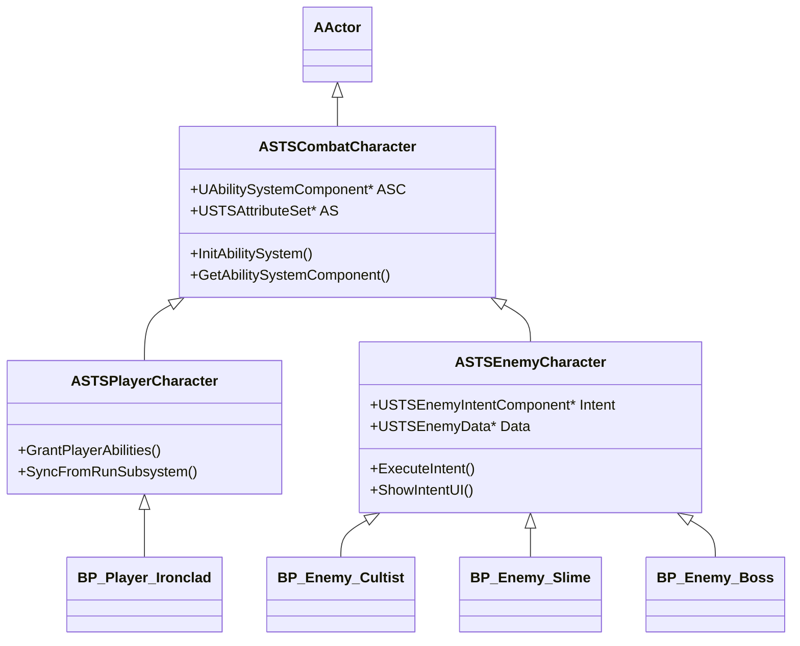

**C++ 写基类，蓝图做具体角色外观与数据引用。**

---

### 4.3.2 玩家英雄（ASTSPlayerCharacter）

**职责划分：**

| 数据/逻辑 | 存放位置 | 原因 |
|-----------|----------|------|
| 跨战斗最大 HP、当前 HP、牌组、遗物、金币 | `RunSubsystem` | 跨关卡持久化 |
| 本场 Block / Energy / 战斗 Buff | 玩家 `AttributeSet` | GAS 战斗内状态 |
| 手牌 / 抽弃牌堆 | `CombatManager` | 牌堆不是 Ability，不宜塞 ASC |
| 打牌行动 | `GA_PlayCard` | GAS 行动授权 |
| 遗物触发 | `GA_RelicListener` + `RelicManager` | 事件驱动 |

**`USTSCharacterData`（PrimaryDataAsset，铁甲战士一条）：**

```cpp
MaxHP = 80
StartingDeck = [Strike×5, Defend×4, Power×1]
StartingRelic = DA_Relic_BurningBlood
CharacterClass = Ironclad
```

**战斗开始初始化顺序：**

```
1. GameMode Spawn BP_Player_Ironclad
2. Player->SyncFromRunSubsystem()
     AS->Health = RunSubsystem.CurrentHP
     AS->MaxHealth = RunSubsystem.MaxHP
3. PlayerASC->InitCombatAbilities()  // Give GA_PlayCard, GA_RelicListener
4. CombatManager.Init(Player, Deck=RunSubsystem.Deck)
5. CombatManager.SendEvent(Event.Combat.Start)  // 蛇之戒指、锚、金刚杵
6. CombatManager.OnPlayerTurnStart()            // 抽 5 张、Energy=3
```

**玩家角色上不挂：** 牌堆组件、地图进度、商店逻辑——这些都在 Subsystem / Manager，角色只作为 **GAS 载体** 和 **UI 锚点**。

---

### 4.3.3 敌人（ASTSEnemyCharacter）

**与玩家的核心差异：**

| 维度 | 玩家 | 敌人 |
|------|------|------|
| 行动方式 | 玩家选手牌 → `GA_PlayCard` | 意图表驱动 → `GA_EnemyAction` |
| Energy | 有 | 无 |
| 牌堆 | 有（Manager 管） | 无 |
| 遗物 | 有 | 无 |
| 意图预告 | 无 | **USTSEnemyIntentComponent** |
| 数据资产 | `USTSCharacterData` | `USTSEnemyData` |

**`USTSEnemyData`（PrimaryDataAsset）：**

```cpp
DisplayName = "邪教徒"
MaxHP = 48
IntentPattern = [
  { IntentType=Attack, Effects=[{Damage, 6}] },
  { IntentType=Attack, Effects=[{Damage, 6}] },
  { IntentType.Defend, Effects=[{Block, 8}] },
  { IntentType.Buff,   Effects=[{ApplyStatus, Ritual, 3}] },  // v0.2
]
// 意图按顺序循环或随机权重
```

**`USTSEnemyIntentComponent`：**

```cpp
int32 CurrentIntentIndex;
const F_STSEnemyIntent* GetCurrentIntent();
void AdvanceIntent();           // 回合末滚到下一条
FText GetIntentDisplayText();   // UI："攻击 6"、"防御 8"
UTexture2D* GetIntentIcon();
```

**敌人 Intent 复用卡牌效果结构：** `F_STSEnemyIntent.Effects` 就是 `TArray<F_STSCardEffect>`，与 Bash、Strike 走同一 Executor——**敌人出招 = 没有卡牌包装的纯效果列表**。

**敌人生成：**

```
1. GameMode 读 EncounterData → Spawn BP_Enemy_Cultist × N
2. Enemy->InitFromData(USTSEnemyData)
     AS->MaxHealth = Data.MaxHP
     AS->Health = Data.MaxHP
3. EnemyASC->GiveAbility(GA_EnemyAction)
4. IntentComponent.SetPattern(Data.IntentPattern)
5. IntentComponent.AdvanceIntent()  // 显示首回合意图
```

**敌人回合：**

```
CombatManager.OnEnemyTurn
  foreach Enemy in AliveEnemies:
    EnemyASC->TryActivateAbility(GA_EnemyAction)  // 执行当前 Intent
    IntentComponent.AdvanceIntent()               // 下回合意图预告
```

---

### 4.3.4 玩家与敌人「同构」设计的好处

1. **共用 `USTSAttributeSet`**：`GE_Damage` 对玩家和敌人完全对称（玩家也会被敌人打）。
2. **共用 `STSEffectExecutor`**：卡、遗物、敌人 Intent 三种来源同一套效果管线。
3. **共用 `ASTSCombatCharacter` 基类**：`IAbilitySystemInterface`、受击 UI、死亡动画触发点一致。
4. **分叉只在 GA 层**：玩家 `GA_PlayCard`，敌人 `GA_EnemyAction`；不分叉 Attribute 和 GE。

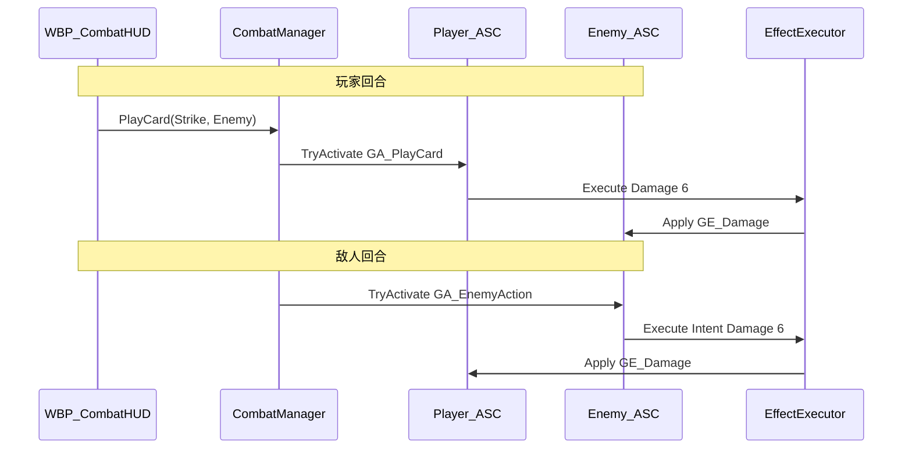

---

### 4.3.5 初版具体角色内容

| 蓝图 | 基类 | DataAsset | 特点 |
|------|------|-----------|------|
| `BP_Player_Ironclad` | `ASTSPlayerCharacter` | `DA_Char_Ironclad` | HP80，起手 10 张牌 + 燃烧之血 |
| `BP_Enemy_Cultist` | `ASTSEnemyCharacter` | `DA_Enemy_Cultist` | HP48，6/6 攻、8 防循环 |
| `BP_Enemy_Slime` | `ASTSEnemyCharacter` | `DA_Enemy_Slime` | HP28，仅 5 伤攻击（新手怪） |
| `BP_Enemy_Boss` | `ASTSEnemyCharacter` | `DA_Enemy_Boss` | HP90，攻 10 / 防 12 / 攻 8 循环 |

---

### 4.3.6 不放进 GAS 的东西（避免过度 GAS 化）

| 系统 | 原因 |
|------|------|
| 手牌区 UI 布局 | UMG |
| 地图节点 | RunSubsystem + DataAsset |
| 商店价格 | RunSubsystem |
| 敌人意图 **显示** | IntentComponent 提供文本/图标，UI 读取 |
| 卡牌在牌堆中的 **实例 ID** | CombatManager 普通 TArray |

GAS 只包 **「单位属性」和「效果/行动」**；尖塔的 **牌堆管理** 和 **地图** 用普通 UE 架构更清晰，也便于学习时分清边界。

---

## 五、初版（v0.1）交付范围与内容清单

### 5.1 必须可玩通

- 1 个角色（铁甲战士简化版），初始牌组 10 张（5×Strike, 4×Defend, 1×Power）
- 15 张卡池（战斗奖励 3 选 1）
- 2 种普通怪 + 1 Boss（各 1 套 Intent 表）
- 5 个遗物（燃烧之血 / 蛇之戒指 / 锚 / 金刚杵 / 奥利哈钢，见 §3.1.4）
- 地图 8 节点（2 分叉 → 商店/休息 → 汇合 → Boss）
- 商店 + 休息点 + 金币
- 战斗 UI：手牌、能量、血条、格挡、敌人意图、弃牌/抽牌堆数量

### 5.2 刻意不做（留给后续学习迭代）

- 多角色、卡牌升级、药水、随机事件、精英房、动画特效打磨
- 网络复制、存档系统
- 复杂 AI（Intent 表驱动即可）

---

## 六、实施步骤（建议顺序）

### Phase 0 — 现有 unrealSTS 工程初始化（见 §4.0.10）
- 清理 `我的项目/`，创建 `Plugins/STSFramework` 插件骨架
- 修改 `unrealSTS.uproject` 启用 GAS + STSFramework；更新 Build.cs
- 创建 `Content/STS/` 目录树；配置 `STSGameplayTags.ini` + `FSTSGameplayTags`
- 实现 `USTSAbilitySet`（Lyra 式 Give/Remove）

### Phase 1 — GAS 战斗核心（C++）
- 实现 AttributeSet、ASC、基础 GE（Damage / Block / EnergyReset / Status）
- 实现 `ASTSCombatGameState` 回合状态机与牌堆（抽/弃/消耗）
- 实现 `STSDamageCalculation` 伤害管线
- 单元验证：PIE 里用调试命令/临时 GA 测 HP、格挡、状态

### Phase 2 — 数据驱动卡牌与首场战斗
- 实现 `F_STSCardEffect` + `STSEffectExecutor` + 通用 `GA_PlayCard`
- 配置 GE 模板库（Damage / Block / Status × 3）
- 新建 5 个 `USTSCardData`（Strike / Defend / Bash / Poison / AoE），验证「只改数据、不改 GA」
- 1 个敌人 + Intent UI（敌人复用 Executor）
- `WBP_CombatHUD`：手牌点击出牌，结束回合按钮

### Phase 3 — Run 层、遗物与地图
- `STSRunSubsystem`：牌组、遗物列表、金币、地图节点状态
- `STSRelicManager` + `GA_RelicListener` + CombatManager 事件广播（`Event.Combat.*` / `Event.Turn.*`）
- 配置 5 个 `USTSRelicData`（§3.1.4），验证 CombatStart / CombatVictory / PlayerTurnEnd 三条链路
- 地图 UI 选路；战斗胜利 → 卡牌奖励 → 回地图
- 商店 / 休息点 UI 与逻辑（遗物上架 1 个槽位）

### Phase 4 — 内容填充与串联
- 补全 15 卡、5 遗物、2 怪 + Boss、8 节点地图数据
- Boss 战胜利 → 胜利界面；死亡 → 失败界面
- README 补充：GAS 类图、**DataAsset 加卡/加遗物步骤**、遗物触发 Tag 一览、何时才需要 `RelicBehavior` 特殊类

---

## 七、关键代码骨架参考

**AttributeSet 核心属性（C++）：**

```cpp
// USTSAttributeSet — 示意
UPROPERTY(BlueprintReadOnly) FGameplayAttributeData Health;
UPROPERTY(BlueprintReadOnly) FGameplayAttributeData MaxHealth;
UPROPERTY(BlueprintReadOnly) FGameplayAttributeData Block;
UPROPERTY(BlueprintReadOnly) FGameplayAttributeData Energy;
```

**打牌入口（ASC 蓝图可调用）：**

```cpp
UFUNCTION(BlueprintCallable)
bool TryPlayCard(USTSCardData* Card, AActor* Target);
// 内部：
// 1. 检查 PlayerTurn Tag、Energy >= Card->Cost、CardCondition 满足
// 2. 扣能量（GE 或 Attribute 直接改）
// 3. EffectExecutor->Execute(Card->Effects, Source, Target)
// 全程只激活 GA_PlayCard 一次，或甚至不激活 GA、由 Manager 直接调 Executor（两种皆可，推荐保留 GA 以学习 CanActivate/Cost 流程）
```

**效果描述结构（每张卡的数据，非 GA）：**

```cpp
USTRUCT(BlueprintType)
struct F_STSCardEffect {
    E_STSEffectType EffectType;   // Damage, Block, ApplyStatus, DrawCards...
    float Magnitude;
    FGameplayTag StatusTag;       // 仅 ApplyStatus 时用
    E_STSTargetType TargetOverride; // 可选，覆盖卡默认目标
};
```

**回合开始事件（CombatManager）：**

```cpp
void OnPlayerTurnStart() {
  ApplyGE_EnergyReset();      // Energy = 3
  ApplyGE_ClearBlock();       // Block = 0
  DrawCards(5);
  BroadcastTurnStarted();
}
```

---

## 八、学习路径建议（配合开发）

1. **先 C++ 跑通 ASC + GE 模板 + Executor 打 1 张 Strike**：理解 Attribute、GE Spec、SetByCaller。
2. **再只建 DataAsset 加 Defend / Bash**：理解「内容 = 数据，代码 = 管线」。
3. **然后做 CombatManager 回合**：理解 GAS 与游戏阶段解耦；抽牌/能量走 Manager，伤害/状态走 GE。
4. **最后做遗物（共用 Executor）+ RunSubsystem**：理解被动触发 GA 与跨关卡状态。

---

## 九、风险与对策

| 风险 | 对策 |
|------|------|
| GAS 学习曲线陡 | C++ 写 Executor + GE 模板；加卡只建 DataAsset，README 写「加卡 3 步」 |
| 一卡一 GA 不可维护 | 通用 `GA_PlayCard` + `F_STSCardEffect` 数组；复杂卡才用 Condition / 特殊 GA |
| 回合制与 Tick 持续 GE 冲突 | 中毒等用「回合结束事件 + 层数 Attribute」而非每帧 Tick |
| 牌堆逻辑放 GA 里混乱 | 牌堆 exclusively 由 CombatManager 管，GA 只负责效果 |
| 地图+战斗跨关卡状态丢失 | 全部跑层状态放 GameInstance Subsystem |
| 框架与内容耦合 | STSFramework 插件零 Content 依赖；角色卡池未来拆 STSContent_* 插件 |
| Tag 混乱无规范 | 统一 `STS.` 前缀 + `FSTSGameplayTags` 强类型访问，禁止魔法字符串 |
