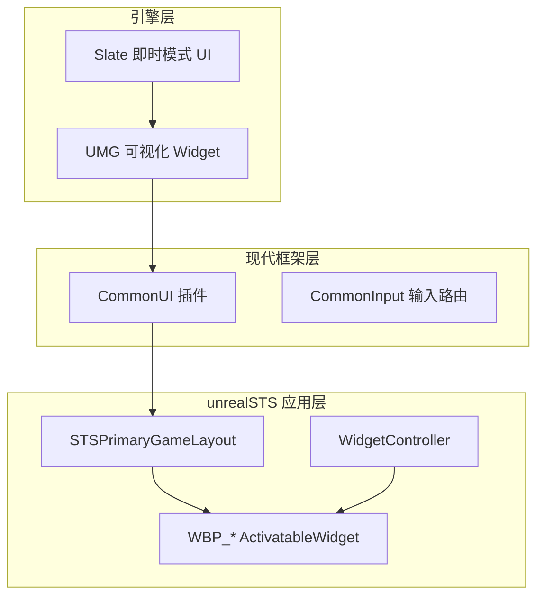
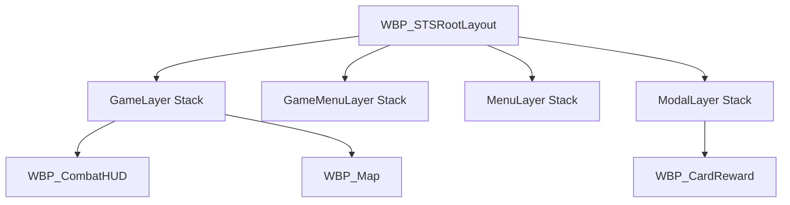
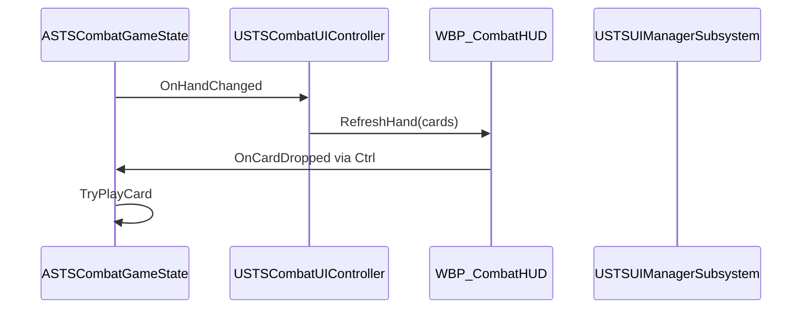
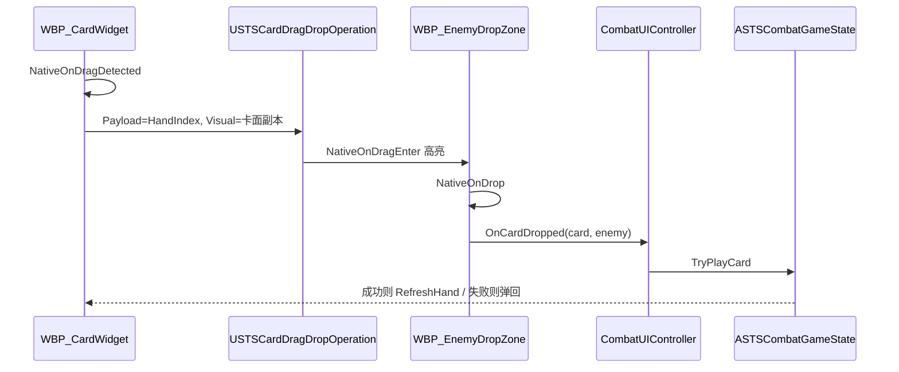
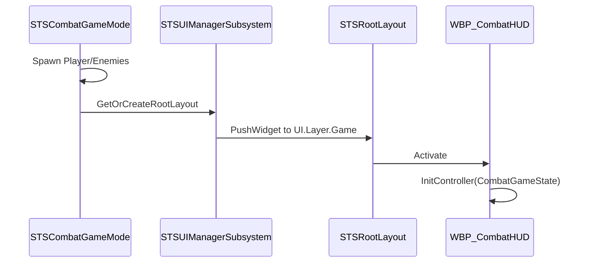

# unrealSTS UI 框架设计方案（CommonUI + Lyra 分层）

## 一、Unreal UI 技术栈概览



| 层 | 技术 | 职责 |
|----|------|------|
| **Slate** | C++ 底层 | 不直接使用（UMG 编译产物） |
| **UMG** | `UUserWidget` / Designer | 布局、贴图、动画 |
| **CommonUI** | `UCommonActivatableWidget` | 输入路由、分层栈、焦点、样式 |
| **WidgetController** | 自研 `UObject` | **View 与逻辑分离**，订阅 `ASTSCombatGameState` / ASC |
| **数据** | `ASTSCombatGameState` / `USTSRunSubsystem` | UI **不持有** 游戏状态 |

**不引入完整 Lyra CommonGame 插件**：仅启用引擎自带 [`CommonUI`](F:/UE_5.7/Engine/Plugins/Runtime/CommonUI/CommonUI.uplugin)，自研轻量 `USTSUIManagerSubsystem`（对标 Lyra `GameUIManager`），避免拷贝 Lyra 大量依赖。

---

## 二、Lyra 核心思想在本项目的映射

| Lyra 概念 | unrealSTS 对应 |
|-----------|----------------|
| `UPrimaryGameLayout` | `USTSPrimaryGameLayout`（C++ 子类） |
| `W_OverallUILayout` | `WBP_STSRootLayout`（4 层 WidgetStack） |
| `UI.Layer.*` Tag | `STS.UI.Layer.Game/GameMenu/Menu/Modal` |
| `UCommonActivatableWidget` | 所有可交互界面基类 |
| `UI Policy` | `DefaultGame.ini` 配置 + `USTSUIPolicy` DataAsset |
| Game Feature HUD Action | `STSCombatGameMode` 启动时 Push 对应 Widget |

### 2.1 分层输入栈（与 Lyra 一致）

| 优先级 | GameplayTag | 用途 | 尖塔界面 |
|--------|-------------|------|----------|
| 1（最低） | `STS.UI.Layer.Game` | 游戏内 HUD | `WBP_CombatHUD`、`WBP_Map` |
| 2 | `STS.UI.Layer.GameMenu` | 游戏内叠加面板 | `WBP_Shop`、`WBP_RestSite` |
| 3 | `STS.UI.Layer.Menu` | 全屏菜单 | `WBP_MainMenu` |
| 4（最高） | `STS.UI.Layer.Modal` | 模态弹窗 | `WBP_CardReward`、`WBP_Confirm` |

**规则：** 只有**当前最高优先级可见栈顶** Widget 接收输入；Modal 打开时战斗 HUD 不响应点击。



---

## 三、MVC 变体：Widget + WidgetController（推荐）

**Widget（View）只做：**
- 显示数值、播放动画
- 转发按钮点击 → Controller
- **禁止**在 Widget 里 `GetSubsystem`、改牌堆、Apply GE

**WidgetController（Presenter）只做：**
- 持有 `TWeakObjectPtr<ASTSCombatGameState>` / `USTSRunSubsystem` / Player ASC
- 订阅 Delegate：`OnHandChanged`、`OnHealthChanged`、`OnTurnPhaseChanged`
- 调用 Widget 的 `UpdateXxx()` 方法（显式 Setter，**不用 UMG Property Binding 每帧 Tick**）



### 3.1 Controller 清单

| Controller | 绑定数据源 | 驱动 Widget |
|------------|-----------|-------------|
| `USTSCombatUIController` | `ASTSCombatGameState` + Player ASC | `WBP_CombatHUD` |
| `USTSMapUIController` | RunSubsystem | `WBP_Map` |
| `USTSShopUIController` | RunSubsystem | `WBP_Shop` |
| `USTSCardRewardUIController` | `USTSRunSubsystem` 战后奖励 | `WBP_CardReward` |
| `USTSRelicBarUIController` | RunSubsystem.OwnedRelics | `WBP_RelicBar`（可嵌在 HUD） |

Controller 放 **STSFramework 插件 C++** 或 `Source/unrealSTS`（初版建议 C++ 基类在插件，蓝图子类可选）。

---

## 四、各界面设计要点

### 4.1 战斗 HUD（`WBP_CombatHUD`）

```
┌─────────────────────────────────────────────┐
│ WBP_RelicBar  WBP_StatusBar(玩家)           │
│                                             │
│         [敌人意图]  Enemy HP/Block          │
│                                             │
│  WBP_HandContainer (HorizontalBox)          │
│  └─ WBP_CardWidget × N (池化复用)           │
│                                             │
│  Energy: 3/3   Draw:12  Discard:5           │
│              [结束回合]                      │
└─────────────────────────────────────────────┘
```

- **手牌：** `USTSUICardPool` 实现 `ICommonPoolableWidgetInterface`，`ASTSCombatGameState` 手牌变化时 Refresh，不 Destroy/Create
- **出牌（默认）：鼠标拖动** → 见 **§4.1.1**；点击出牌作为辅助（XCost 卡、触屏）
- **能量/格挡：** 读 Player ASC Attribute，监听 `OnAttributeChanged`（Phase 1 实现 AttributeSet 后接通）
- **敌人意图：** 读 `USTSEnemyIntentComponent::GetIntentDisplayText()`

### 4.1.1 拖动出牌（UE 5.7 + CommonUI，可行）

**结论：可以做到。** 拖放是 **UMG/Slate 内建能力**（[`UDragDropOperation`](https://dev.epicgames.com/documentation/en-us/unreal-engine/API/Runtime/UMG/UDragDropOperation)），与 CommonUI 分层 **不冲突**——拖动发生在 `WBP_CombatHUD` 子树内，CommonUI 只负责哪一层接收「点击/焦点」，不阻止 Slate `BeginDragDrop`。



| 组件 | 实现 |
|------|------|
| `USTSCardDragDropOperation` | 继承 `UDragDropOperation`；`Payload` = 手牌索引或 `FSTSCardInstance` |
| `USTSCardWidget` | C++ 基类覆写 `NativeOnDragDetected`；**不用 CommonButtonBase 做卡面** |
| `WBP_EnemyDropZone` | 每个敌人头顶/立绘区；`NativeOnDragOver/OnDrop`；`Visibility=SelfHitTestInvisible` 可接收 Drop |
| `WBP_PlayAreaDropZone` | 可选：全体攻击卡拖到战场中央 |
| 拖放视觉 | `DefaultDragVisual` = 半透明卡面 Widget；原手牌位 `RenderOpacity=0.5` |

**UE 5.7 + CommonUI 注意点：**

1. **不要用 `UCommonButtonBase` 承载卡牌拖动。** UE 5.7 虽给 CommonButton 加了 Drag API，但论坛反馈 **列表外默认拖放可能不生效**，需子类覆写 `HandleButtonDragDetected` 手动 `BeginDragDrop`。卡牌更适合 **`UUserWidget` / 自研 `USTSCardWidget` 直接走 `NativeOnDragDetected`**。
2. **Drop 目标必须是 Widget**，不是 3D Actor。尖塔风格用敌人 **立绘/UI DropZone** 即可，无需射线检测场景。
3. **拖动中禁止 Modal 层抢输入**：战斗时不要让 `UI.Layer.Modal` 有遮挡 Widget；选目标阶段可临时 `SetInputMode` 仅 UI。
4. **`OnDragCancelled`**：拖到非法区域松手 → 播放「弹回手牌」动画，不扣能量。
5. **可打出校验**：`OnDragOver` 时根据 `CanActivate` 将 DropZone 边框变绿/红；`OnDrop` 再正式 `TryPlayCard`。
6. **性能**：DragVisual 用轻量 Widget；手牌池化实例在拖动结束后恢复 Opacity，不 Destroy。

**初版交互优先级：**

| 操作 | 方式 |
|------|------|
| 单体攻击/技能 | **拖到敌人 DropZone** |
| 全体攻击 | 拖到 `WBP_PlayAreaDropZone` |
| Self 卡 | 拖到自己角色 StatusBar 或双击 |
| 不可打出 | DragDetected 时即禁用 / DragOver 显示红框 |
| 触屏（后续） | 点击选卡 → 再点目标（无拖放） |

### 4.2 卡牌 Widget（`WBP_CardWidget`）

| 数据 | 来源 |
|------|------|
| 名称/费用 | `FSTSCardInstance` + `USTSCardData` |
| 边框颜色 | `Card.Rarity.*` Tag → `USTSUICardStyleData` 映射表 |
| `+` 升级标记 | `Card.State.Upgraded` |
| 是否可打出 | Controller 查 Phase + Energy + `GA_PlayCard::CanActivate`；拖动时实时反馈 |
| 拖动 | `USTSCardWidget::NativeOnDragDetected` → `USTSCardDragDropOperation` |

### 4.3 地图 / 商店 / 休息（`WBP_Map` 等）

- **地图节点：** `USTSMapUIController` 读 `RunSubsystem` 当前层节点 → 动态生成 `WBP_MapNodeButton`
- **商店/休息：** Push 到 `UI.Layer.GameMenu`，关闭时 Pop
- **关卡切换：** OpenLevel 前 Controller `Deinitialize`，新关卡 GameMode 重新 Push HUD

### 4.4 模态：战后选卡（`WBP_CardReward`）

- Push 到 `UI.Layer.Modal`，阻塞下层输入
- 显示 3 个 `WBP_CardWidget`（大样式）
- 选中 → `RunSubsystem.AddCardToDeck` → Pop → 回地图

---

## 五、工程目录（在现有结构上扩展）

```
Content/STS/UI/
├── Layout/
│   └── WBP_STSRootLayout.uasset       # 4 层 CommonActivatableWidgetStack
├── Styles/
│   ├── STSButtonStyle.uasset          # CommonButtonStyle
│   └── STSCardRarityStyle.uasset      # 稀有度颜色映射
├── Combat/
│   ├── WBP_CombatHUD.uasset
│   ├── WBP_CardWidget.uasset
│   ├── WBP_HandContainer.uasset
│   └── WBP_EnemyIntent.uasset
├── Map/
│   ├── WBP_Map.uasset
│   └── WBP_MapNodeButton.uasset
├── Shop/
│   └── WBP_Shop.uasset
├── Reward/
│   └── WBP_CardReward.uasset
└── Common/
    ├── WBP_RelicBar.uasset
    ├── WBP_StatusBar.uasset
    └── WBP_ConfirmModal.uasset

Plugins/STSFramework/Source/STSFramework/Public/UI/
├── STSPrimaryGameLayout.h
├── STSUIManagerSubsystem.h
├── STSUIPolicy.h
├── STSActivatableWidget.h             # 项目 Activatable 基类
├── STSWidgetController.h              # Controller 基类
├── STSCombatUIController.h
├── STSCardWidget.h                    # 卡牌 Widget C++ 基类（DragDetected）
├── STSCardDragDropOperation.h         # 拖放 Payload
├── STSEnemyDropZoneWidget.h           # 敌人 Drop 区域
├── STSUICardPool.h
└── STSUICardStyleData.h
```

C++ 模块依赖扩展：[`STSFramework.Build.cs`](unrealSTS/Plugins/STSFramework/Source/STSFramework/STSFramework.Build.cs) 添加 `CommonUI`、`CommonInput`。

[`unrealSTS.uproject`](unrealSTS/unrealSTS.uproject) 启用 `CommonUI` 插件。

---

## 六、配置与启动流程

### 6.1 DefaultGame.ini

```ini
[/Script/unrealSTS.STSUIPolicy]
RootLayoutClass=/Game/STS/UI/Layout/WBP_STSRootLayout.WBP_STSRootLayout_C
```

### 6.2 战斗关卡启动 UI



### 6.3 Tag 扩展（加入 `STSGameplayTags`）

```
STS.UI.Layer.Game
STS.UI.Layer.GameMenu
STS.UI.Layer.Menu
STS.UI.Layer.Modal
```

---

## 七、性能与规范（Lyra 最佳实践）

| 规范 | 原因 |
|------|------|
| **禁止 UMG Property Binding** 绑定每帧变化数据 | 避免隐形 Tick，改 Controller 显式 `Refresh` |
| 手牌 Widget **对象池** | 一战斗抽牌数十次，避免 GC 抖动 |
| 静态区域加 **InvalidationBox** | 背景、遗物栏等不每帧重绘 |
| Widget **禁止 Tick** | `Never` 除非动画中 |
| 样式用 **CommonButtonStyle / DataAsset** | 改一处全局生效 |

---

## 八、与 GAS / 框架的边界

| 系统 | UI 如何交互 |
|------|-------------|
| 出牌 | UI → `ASTSCombatGameState` → `GA_PlayCard`（UI 不直接 Activate GA） |
| HP/Block 显示 | ASC Attribute Delegate → Controller → Widget |
| Buff 图标 | ASC `GetActiveEffectsWithAllTags` → `WBP_StatusBar` |
| 遗物 | RunSubsystem 列表 → `WBP_RelicBar` |
| 回合阶段 | `ASTSCombatGameState` 广播 → Controller 控制「结束回合」按钮 Enabled |

---

## 九、实施阶段（建议插入总计划）

### UI-Phase 0（依赖 Phase 1 GAS 核心）
- 启用 CommonUI 插件；`STSPrimaryGameLayout` + `STSUIManagerSubsystem` + `WBP_STSRootLayout`
- 注册 `STS.UI.Layer.*` Tag

### UI-Phase 1（首场战斗可交互）
- `USTSCardWidget` + `USTSCardDragDropOperation` + `WBP_EnemyDropZone`
- `USTSUICardPool` + `USTSCombatUIController`
- `WBP_CombatHUD`：手牌拖动、能量、结束回合
- 打通：**拖动 Strike 到敌人** → 扣血；非法区域 Cancel 弹回

### UI-Phase 2（单局循环 UI）
- `WBP_Map`、`WBP_CardReward`、`WBP_Shop`、`WBP_RelicBar`
- Modal 栈管理战后选卡

### UI-Phase 3（打磨）
- CommonButtonStyle 统一风格；卡牌稀有度样式；Intent 动画

---

## 十、与现有 Phase 0 的关系

当前 [Phase 0](unrealSTS/Plugins/STSFramework) 已完成 GAS 插件骨架。**UI 框架不阻塞 Phase 1**，但战斗可玩性验证需要 **UI-Phase 1** 与 **GAS Phase 2** 同步推进。

推荐顺序：**GAS Phase 1（AttributeSet/ASTSCombatGameState）→ UI-Phase 0/1 → GAS Phase 2 首场战斗串联**。
